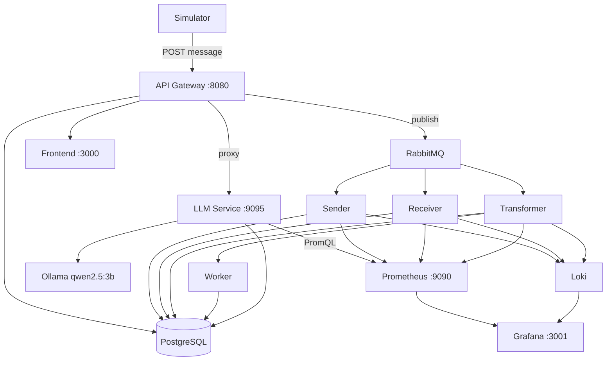

# EDI Transaction Simulator

A microservices playground that simulates EDI document flows between trading partners — with real-time monitoring, format transformation (X12, EDIFACT, XML), a dead-letter queue, and an on-device LLM for failure analysis and metrics insights.

## Architecture



**Services at a glance**

| Service                       | Role                                                                      |
| ----------------------------- | ------------------------------------------------------------------------- |
| `api-gateway`                 | REST API, routes to all services                                          |
| `simulator`                   | Continuously generates EDI messages across 8 trading partners             |
| `sender / receiver`           | Pipeline stages: send → receive                                           |
| `transformer`                 | Converts between X12, EDIFACT, XML via canonical model                    |
| `worker`                      | Finalises processed messages                                              |
| `llm-service`                 | Async LLM jobs: failure classification, health insights, metrics analysis |
| `ollama`                      | Local inference (qwen2.5:3b, no cloud)                                    |
| `prometheus / grafana / loki` | Full observability stack                                                  |

## Start

**Prerequisites:** Docker + Docker Compose

```bash
# Build all images
docker compose build

# Start all 16 services
docker compose up -d

# Pull the LLM model (first run only, ~2 GB)
docker exec edi-ollama ollama pull qwen2.5:3b

# Tear down
docker compose down
```

| UI        | URL                    |
| --------- | ---------------------- |
| Dashboard | http://localhost:3000  |
| API       | http://localhost:8080  |
| Grafana   | http://localhost:3001  |
| RabbitMQ  | http://localhost:15672 |

## PDF Export

Every message detail view includes **Preview PDF** and **Download PDF** actions. PDFs are generated entirely in the browser (no server round-trip) using the canonical form already produced by the transformer service:

- **Transformed messages** — structured layout: header band, PO number / date / currency strip, buyer and seller party boxes, line-items table with per-line totals and grand total, transmission details.
- **Untransformed messages** — clean info block + labelled raw EDI fallback.

Files are named `edi-<id>-<timestamp>.pdf` and download instantly.
