# EDI Transaction Simulator & Testing Sandbox

## Project Vision

Build a system that simulates EDI transactions flowing between trading partners, with real-time monitoring, format transformation, and an intuitive UI that lets users generate messages in one format, transform them to another, and visualize the entire flow.

**A professional-grade learning project that teaches software architecture through practical decisions, not tutorials.**

---

## Why This Project

- ✓ Leverages EDI domain expertise — no learning curve on business logic
- ✓ Directly applicable to presales roles — demo tool + technical credibility
- ✓ Architecture-rich — forces real design decisions at every layer
- ✓ Clear stopping points — each phase delivers working value
- ✓ Portfolio-worthy — visual, interactive, demonstrates system thinking
- ✓ Teaches breadth, not depth — software architect mindset

---

## Core Learning Objectives

### Architectural Patterns & Design

- API design patterns and versioning strategies
- Synchronous vs asynchronous processing trade-offs
- Message queue patterns and reliability guarantees
- Data storage decisions (when to use which persistence layer)
- Event-driven architecture fundamentals
- Service boundary design and inter-service communication

### Operational Concerns

- Error handling and retry strategies
- Real-time UI updates and state management
- Observability: logging, metrics, tracing
- Containerized multi-service applications

---

## System Architecture

### High-Level Architecture Diagram

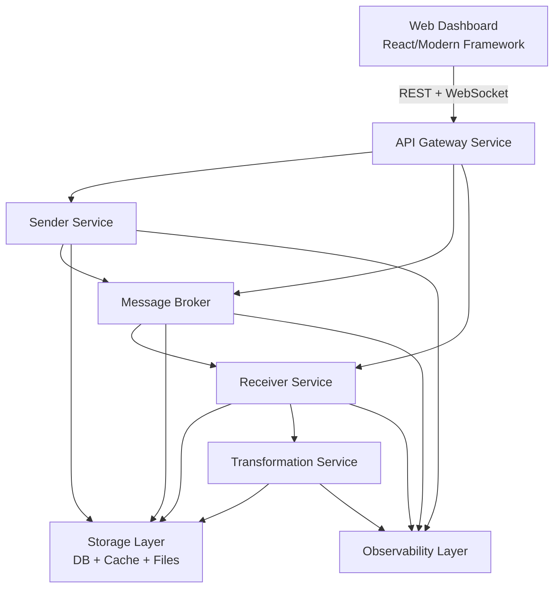

### Key Architectural Decisions to Make

|Decision|Options|Impact|
|---|---|---|
|**Message transport**|Queue vs Stream vs Direct|Affects scalability, ordering, replay|
|**API patterns**|REST vs GraphQL; Sync vs Async|Client complexity, latency|
|**Storage strategy**|SQL vs Cache vs Files|Performance, consistency, queries|
|**Error handling**|Immediate retry vs backoff vs DLQ|Reliability, delivery guarantees|
|**Transformation**|Code-based vs config-driven|Flexibility, maintainability|
|**Real-time updates**|WebSocket vs SSE vs Polling|Complexity, resource usage, latency|
|**Service boundaries**|Monolith vs separate services|Team structure, deployment, complexity|
|**Validation strategy**|Schema-based vs rule-based|Consistency, flexibility, detection|

---

# Phased Build Approach

Build incrementally with clear milestones. Each phase is independently valuable and delivers working functionality.

---

## Phase 1: Foundation — "Hello World Architecture"

**Timeline:** 8-12 hours | Week 1

### Goal

Get the skeleton running with minimal features. Establish service boundaries and basic flow.

### Deliverable

A system that sends one hardcoded EDI message through the complete flow.

### Components

- **API Gateway** with 3 basic endpoints (simulate, list, health)
- **Sender service** — generates one hardcoded EDI 850 (Purchase Order)
- **Receiver service** — consumes message, validates, stores
- **Database** — transaction metadata
- **Docker Compose** — all services running together

### Architectural Decisions

- File-based vs Queue-based messaging (try both, compare)
- Database choice and schema design
- Synchronous vs asynchronous API responses

### Success Criteria

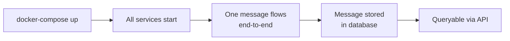

### Value Delivered

- Working system with clear service boundaries
- Can demonstrate message flow through architecture
- Foundation for all subsequent phases

---

## Phase 2: Realistic Data — "Add Intelligence"

**Timeline:** 10-15 hours | Week 2

### Goal

Generate realistic EDI messages with variation and error scenarios.

### Deliverable

Configurable message generation with multiple transaction types and realistic scenarios.

### Enhancements

- **Message templates** — different EDI types (850, 856, 810, etc.)
- **Configuration system** — control message types, rate, duration, error injection
- **Sender enhancement** — generates at specified rate with realistic variation
- **Parser enhancement** — reads actual EDI format, validates structure
- **Error injection** — malformed segments, wrong dates, invalid fields
- **Enhanced tracking** — message status (sent, received, validated, failed)

### Architectural Decisions

- Message template structure (data models vs templates vs builders)
- Error injection strategy (random vs deterministic patterns)
- Validation approach (schema-based vs rule-based)
- Failure handling (store and continue vs halt)

### Success Criteria

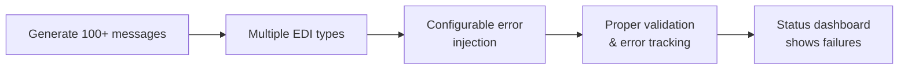

### Value Delivered

- Realistic test data generator
- Deep understanding of EDI format
- Configurable platform for testing scenarios
- Ready for realistic performance testing

---

## Phase 3: Message Queue — "Scale & Reliability"

**Timeline:** 12-15 hours | Week 3

### Goal

Replace file-based messaging with proper message broker. Implement reliability patterns.

### Deliverable

Event-driven architecture with reliable, scalable message processing.

### New Components

- **Message broker** — queue or stream system
- **Async message publishing** — from sender service
- **Async message consumption** — by receiver service
- **Retry logic** — with exponential backoff
- **Dead letter queue** — for permanently failed messages
- **Queue monitoring** — endpoints and dashboards

### Message Flow Pattern

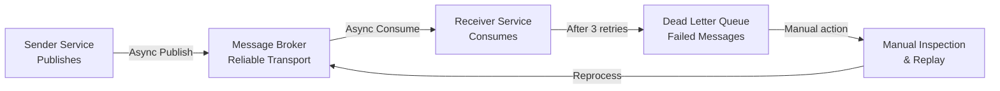

### Architectural Decisions

- Message broker choice (Kafka? RabbitMQ? SQS?)
- Delivery guarantees (at-least-once vs exactly-once)
- Retry strategy (immediate vs delayed vs exponential backoff)
- When to give up (retry count or timeout)
- Ordering guarantees (required or not)

### Success Criteria

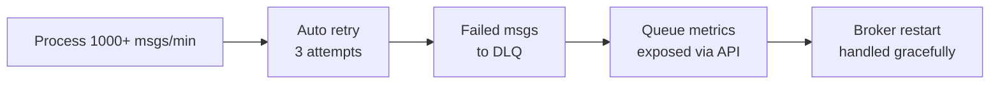

### Value Delivered

- Production-grade messaging patterns
- Graceful failure handling and recovery
- Scalable message processing
- Observable message flow for debugging

---

## Phase 4: Web Dashboard — "Visualization & Control"

**Timeline:** 15-20 hours | Week 4

### Goal

Build intuitive UI for monitoring, control, and interactive message transformation.

### Deliverable

Beautiful, responsive dashboard with real-time updates and message builder.

### UI Features

#### Real-Time Monitoring

- **Live transaction feed** — updates as messages flow through system
- **Metrics dashboard** — throughput, error rates, queue depths
- **System health** — service status, resource usage

#### Interactive Control

- **Simulation control panel** — start/stop, configure parameters
- **Message builder** — create EDI messages interactively
- **Format selector** — choose source and target formats
- **Transform button** — trigger transformation, visualize flow

#### Analytics & Debugging

- **Error analysis view** — common failure patterns, trends
- **Transaction detail view** — full message content, validation results
- **Audit trail** — track message through entire pipeline

### Transformation Flow Visualization

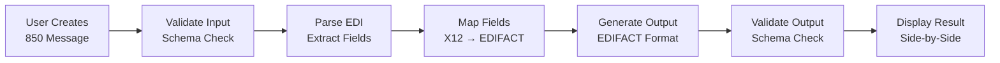

### Architectural Decisions

- Real-time communication (WebSocket vs SSE vs Polling)
- State management strategy
- API design for UI needs
- Data visualization approach
- Performance with high-frequency updates

### Success Criteria

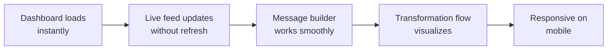

### Value Delivered

- Portfolio-worthy visual interface
- Professional presentation of technical concepts
- Demonstrates full-stack capability
- Shows UX thinking alongside backend architecture

---

## Phase 5: Transformation Engine — "Core EDI Value"

**Timeline:** 12-18 hours | Week 5

### Goal

Add format transformation. Convert between X12, EDIFACT, XML, and JSON.

### Deliverable

Message transformation service with configurable, auditable mappings.

### Components

- **Transformer service** — reads from transformation queue
- **Mapping configuration system** — define and manage transformation rules
- **Format parsers** — X12, EDIFACT, XML, JSON support
- **Field-level mapping engine** — apply rules and transformations
- **Transformation audit trail** — track what changed and why
- **API endpoints** — create, update, test, manage mappings

### Transformation Features

#### Basic Mapping

- One-to-one field mapping
- Multiple input fields to single output (concatenation)
- Multiple output fields from single input (splitting)

#### Advanced Transformation

- Lookup tables for value mapping
- Conditional rules (if segment X exists, then...)
- Calculations and formulas
- Custom transformation functions

#### Data Handling

- Default values for missing fields
- Null/empty field handling
- Unsupported segments (fail vs skip vs default)
- Nested structure handling

### Transformation Pipeline

```mermaid
graph LR
    INPUT["Input Message<br/>X12 Format"]
    LOAD["Load Mappings<br/>Config Rules"]
    VALIDATE_IN["Validate Input<br/>Format Check"]
    PARSE["Parse Input<br/>Extract Fields"]
    TRANSFORM["Apply Mappings<br/>Field by Field"]
    GENERATE["Generate Output<br/>EDIFACT Format"]
    VALIDATE_OUT["Validate Output<br/>Format Check"]
    AUDIT["Record Audit Trail<br/>Transformation Log"]
    OUTPUT["Return Result<br/>Success or Error"]
    
    INPUT --> LOAD
    LOAD --> VALIDATE_IN
    VALIDATE_IN --> PARSE
    PARSE --> TRANSFORM
    TRANSFORM --> GENERATE
    GENERATE --> VALIDATE_OUT
    VALIDATE_OUT --> AUDIT
    AUDIT --> OUTPUT
```

### Architectural Decisions

- Transformation approach (code vs config vs hybrid)
- Mapping representation (JSON config vs DSL vs visual editor)
- Validation timing (before, after, or both)
- Error handling (fail or use defaults)
- Testing strategy
- Performance optimization

### Success Criteria

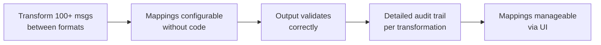

### Value Delivered

- Real EDI transformation capability
- Core business logic demonstration
- Career leverage: "I built a transformation engine for real formats"
- Directly applicable to presales tool

---

## Phase 6 (Optional): Observability — "Production Readiness"

**Timeline:** 10-15 hours | Week 6+

### Goal

Add comprehensive monitoring, logging, and debugging capabilities.

### Deliverable

Observability platform for understanding system behavior and debugging issues.

### Components

- **Structured logging** — JSON logs with correlation IDs from all services
- **Metrics collection** — throughput, latency, error rates, queue depths
- **Visual dashboards** — system health, performance trends, error patterns
- **Distributed tracing** — follow a single message through entire pipeline
- **Alerting rules** — notify when thresholds exceeded
- **Log aggregation** — centralized search and analysis

### Observability Architecture

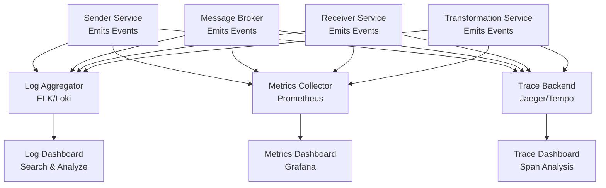

### What to Observe

**Logging Strategy**

- Service startup/shutdown events
- Request/response logging with request ID
- Error conditions and stack traces
- Important business decisions
- Performance-relevant events

**Metrics to Collect**

- Throughput: messages processed per second
- Latency: time from sender publish to receiver store
- Error rate: percentage of failed messages
- Queue depth: backlog in message broker
- Service health: CPU, memory, disk usage

**Tracing Approach**

- Follow single message from entry to exit
- See timing at each service
- Identify performance bottlenecks
- Understand failure paths

**Alerting Rules**

- Queue depth exceeds threshold (backpressure)
- Error rate spikes above baseline
- Service becomes unavailable
- Transformation failures increase
- Resource exhaustion (disk, memory)

### Architectural Decisions

- Logging strategy (what, when, at what level)
- Metrics that matter
- Tracing granularity (performance vs overhead)
- Dashboard design (what insights matter)
- Alert thresholds

### Success Criteria

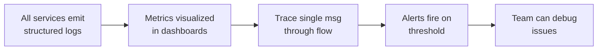

### Value Delivered

- Professional-grade operational excellence
- Deep understanding of production systems
- Ability to troubleshoot complex distributed issues
- Impressive to experienced engineers

---

# Technical Constraints & Principles

## Containerization Strategy

### Docker Compose for Local Development

- All services run in containers from day one
- Simple `docker-compose.yml` orchestrates entire system
- No complex deployment infrastructure needed
- Easy start/stop with single command

### Benefits

- **Reproducibility** — Same environment for all developers
- **Isolation** — Services don't interfere with host
- **Scalability path** — Graduate to Kubernetes later if needed
- **Learning** — Forces thinking about service boundaries

---

## Enterprise-Grade Technology Focus

Use production-ready technologies deployed in real systems:

|Component|Choice|Rationale|
|---|---|---|
|**Message Broker**|Kafka or RabbitMQ|Real EDI platforms use these|
|**Database**|PostgreSQL|Reliable, production-standard|
|**Cache**|Redis|Industry standard, everywhere|
|**API Framework**|Spring Boot, FastAPI, Node.js|Enterprise-ready|
|**Container Runtime**|Docker|De facto standard|
|**Monitoring**|Prometheus + Grafana|Industry standard observability|

---

## Architecture Principles

### Clear Service Boundaries

- Each service owns a specific domain
- Services communicate via well-defined APIs
- No shared databases between services
- Each service has its own data storage

### Event-Driven Where Appropriate

- Use async messaging for service-to-service communication
- Fire-and-forget pattern for non-critical operations
- Event log as audit trail
- Enables decoupling and scalability

### Fail Gracefully with Proper Error Handling

- No silent failures — every error surfaced and logged
- Retry logic with exponential backoff
- Circuit breakers prevent cascade failures
- Dead letter queues for permanently failed messages
- Graceful degradation when dependencies unavailable

### Observable and Debuggable

- Structured logging from all services
- Unique identifiers (trace IDs) follow messages
- Metrics expose system health and performance
- Distributed tracing enables deep debugging
- Clear error messages identify root causes

### Documented Architecture Decisions

- Record major decisions and rationale (Architecture Decision Records)
- Explain trade-offs between alternatives
- Helps future you and team members understand why
- Shows decision-making thought process

---

## Documentation Requirements [[doc-principles-quick]]

### OpenAPI/Swagger Specification

- Auto-generated from code or hand-written
- Documents every API endpoint
- Shows request/response schemas
- Enables API client generation
- Serves as contract between services

### Architecture Diagrams

- **System Context** — How EDI system fits in broader ecosystem
- **Container Diagram** — Services and databases
- **Component Diagram** — Internal structure of key services
- **Data Flow** — How messages move through system
- **Deployment** — How services run in containers

Use C4 Model or simple flowcharts — clarity over sophistication.

### README with Setup Instructions

- Purpose — What this project teaches
- Prerequisites — Docker, language versions, etc.
- Quick Start — How to get running in 5 minutes
- Architecture Overview — System design at high level
- Service Descriptions — What each service does
- Running Different Phases — How to activate/deactivate components
- Testing — How to verify it works
- Troubleshooting — Common issues and solutions

### Decision Log / ADRs

Format: Architecture Decision Records

```
# ADR-001: Use Kafka for Message Broker

## Context
System needs reliable, scalable message transport between services.
Options: RabbitMQ, Kafka, AWS SQS, Pulsar

## Decision
Use Kafka

## Rationale
- Replayable event log (helpful for debugging and retries)
- Partition-based scaling (handles growth)
- Used in real EDI platforms
- Rich ecosystem and community support

## Consequences
- Requires additional infrastructure (Kafka cluster)
- Complexity higher than RabbitMQ
- Team needs to learn Kafka concepts
- Worth it for scalability and learning value
```

---

# Success Metrics

## Technical Achievements Checklist

### Architecture & Design

- [ ] Multi-service system running in Docker containers
- [ ] Clear service boundaries with defined responsibilities
- [ ] Messages flow reliably through end-to-end pipeline
- [ ] Format transformation works correctly between types
- [ ] System handles failures gracefully (retries, DLQ, errors)

### Implementation Quality

- [ ] Comprehensive test coverage (unit, integration, E2E)
- [ ] API documented with OpenAPI/Swagger
- [ ] Architecture documented with diagrams
- [ ] Code organized with consistent patterns
- [ ] Performance meets defined targets

### Observability

- [ ] Structured logging from all services
- [ ] Metrics exposed and visualized
- [ ] Can trace single transaction through system
- [ ] Dashboard shows system health
- [ ] Team can debug production issues

### User Experience

- [ ] UI loads instantly and is responsive
- [ ] Real-time updates work without page refresh
- [ ] Message builder intuitive and functional
- [ ] Transformation visualization clear
- [ ] Mobile-friendly layout

---

## Learning Achievements Checklist

### Architectural Understanding

- [ ] Can explain service boundaries and why they matter
- [ ] Understand synchronous vs asynchronous trade-offs
- [ ] Know when to use different messaging patterns
- [ ] Can design API contracts between services
- [ ] Comfortable with event-driven architecture

### Design Decisions

- [ ] Made deliberate choices about technology
- [ ] Documented why decisions were made
- [ ] Considered and rejected alternatives
- [ ] Could justify each major decision
- [ ] Understand consequences of choices

### System Thinking

- [ ] See how components work together
- [ ] Understand failure modes and cascades
- [ ] Think about scalability early
- [ ] Consider operational aspects
- [ ] Balance features vs complexity

---
# Unique Value of This Project

## Domain Advantage

**EDI knowledge eliminates business logic learning curve.** Your civil engineering and construction background gives you deep EDI expertise. This project focuses 100% on software architecture — the business logic is known territory. You're learning architecture, not explaining EDI to yourself.

## Immediate Applicability to Your Role

**Every concept learned directly applies to presales work.** Can reference implementation in client conversations, demonstrate transformation in action, show technical understanding to engineering teams.

## Natural Scope Boundaries

**Each phase is independently valuable.** Stop after any phase and have something complete and demonstrable:

- After Phase 1: Basic architecture demonstration
- After Phase 2: Realistic test data generator
- After Phase 3: Complete, scalable system (recommended minimum)
- After Phase 4: Professional dashboard
- After Phase 5: Production EDI transformation capability
- After Phase 6: Enterprise-grade observability

## Architecture Focus

**Forces real design decisions.** Not following tutorials — making choices and living with consequences. Understand trade-offs firsthand.

## Portfolio Impact

**Visual, interactive, demonstrates system thinking.** Shows you can design and build complete systems, not just code features. Impressive to hiring managers.

## Career Progression

**Positions you for solutions architect roles.** Demonstrates breadth and system thinking required for senior technical positions.

---

# Getting Started

## This Weekend

1. Set up project structure
2. Create initial docker-compose.yml
3. Build Phase 1 API with one endpoint
4. Get something running

## Week 1

Complete Phase 1 — have working message flow

## Weeks 2-5

One phase per week at comfortable pace

## After Phase 3

**Resulting in a complete, demonstrable system**

- Can stop here or continue to Phases 4-5
- Already learn deeply through making real architectural decisions

## The Goal

Not to finish perfectly, but to learn deeply through making real architectural decisions on a meaningful system.

### Key Timelines

```
THIS WEEKEND:  Set up project structure, Phase 1 skeleton
WEEK 1:        Complete Phase 1 (8-12 hours)
WEEK 2:        Complete Phase 2 (10-15 hours)
WEEK 3:        Complete Phase 3 (12-15 hours) → COMPLETE SYSTEM
WEEK 4:        Complete Phase 4 (15-20 hours) → PROFESSIONAL DASHBOARD
WEEK 5:        Complete Phase 5 (12-18 hours) → TRANSFORMATION ENGINE
WEEK 6+:       Optional Phase 6 (10-15 hours) → ENTERPRISE OBSERVABILITY
```

---

**Start simple. Build incrementally. Learn continuously.**