  

## System Architecture

  

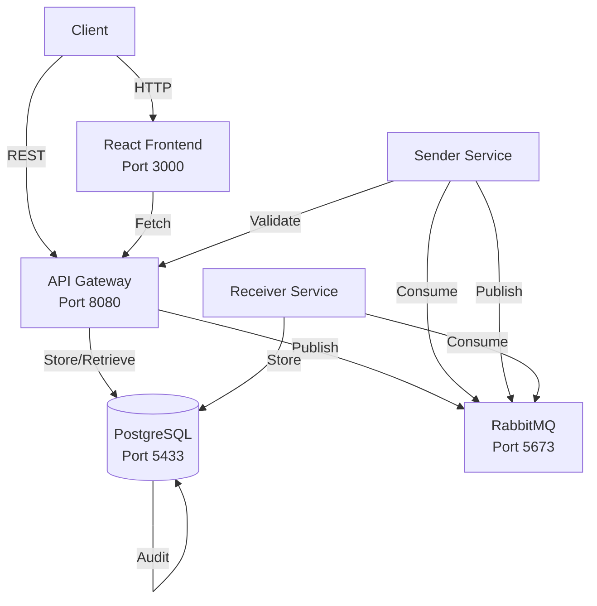

  

## Message Lifecycle

  

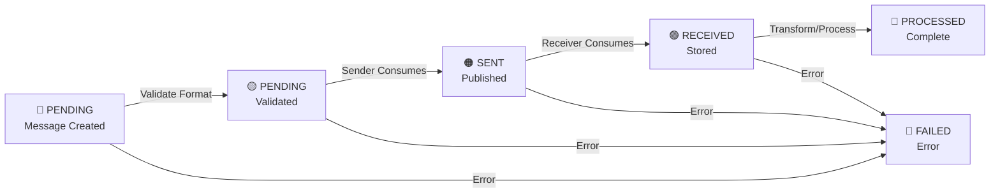

  

## API Endpoints

  

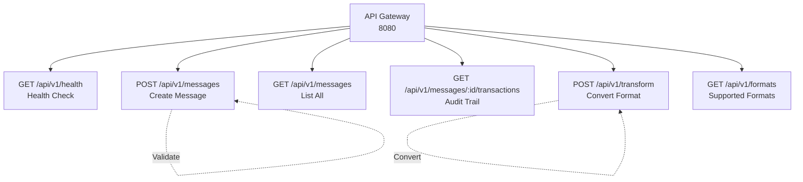

  

## Validation Pipeline

  

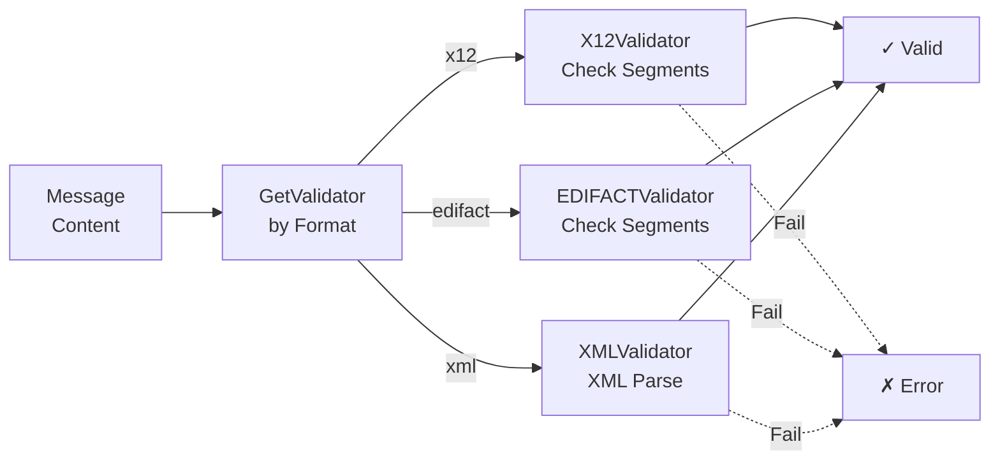

  

## Transformation Routes

  

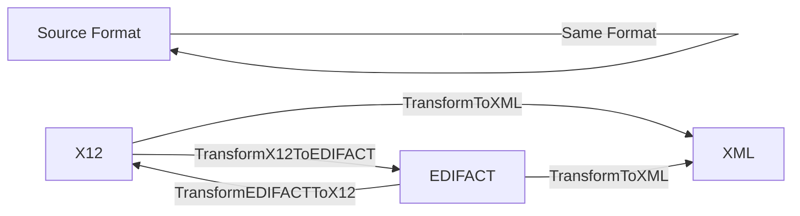

  

## Data Flow: Create & Process Message

  

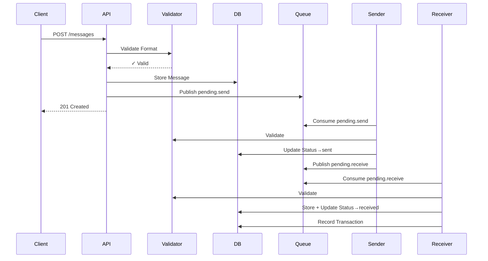

  

## Component Responsibilities

  

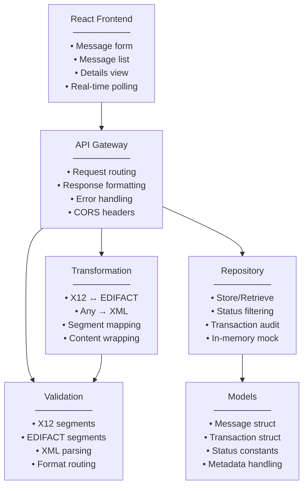

  

## Database Schema (Key Tables)

  

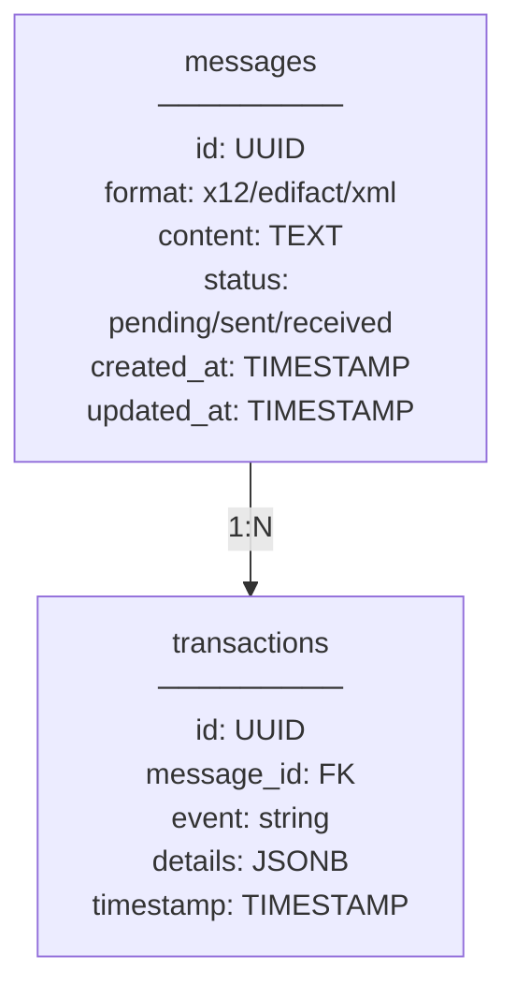

  

## Service Orchestration

  

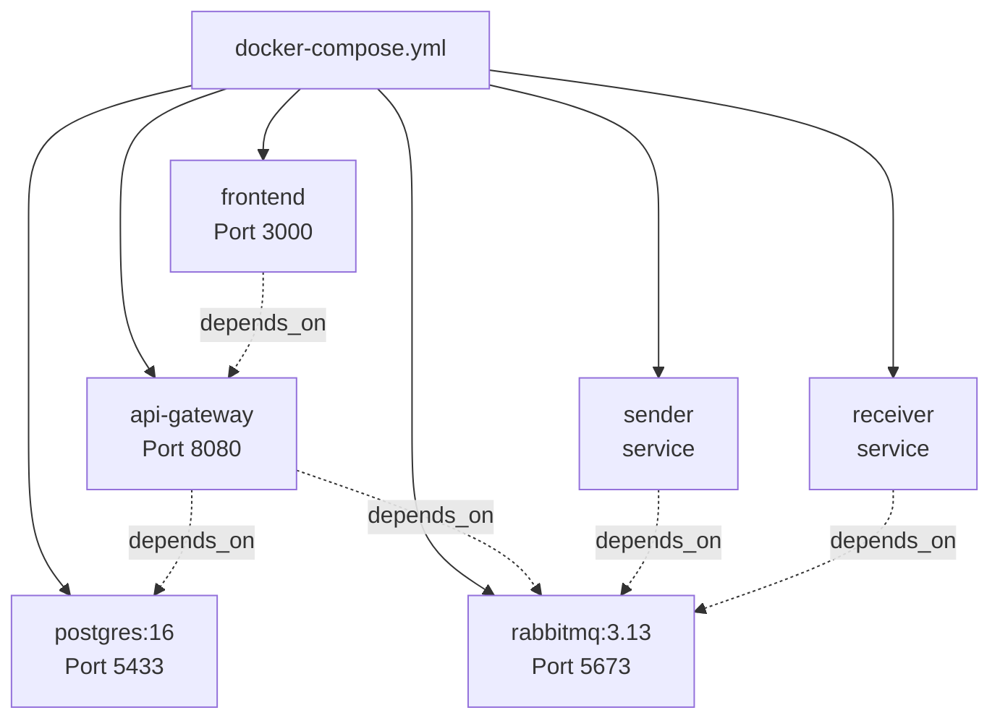

  

## Test Coverage

  

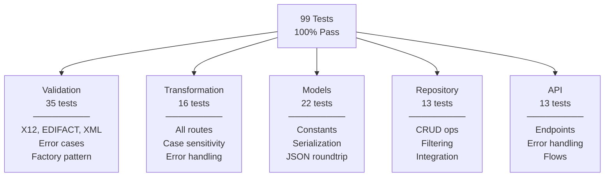

  

## Deployment Stack

  

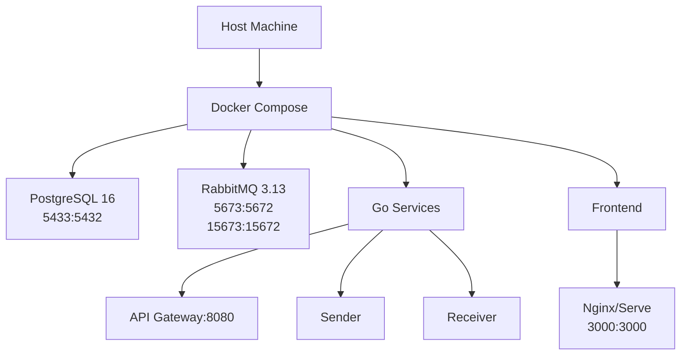

  

## Phase 2 Components Created

  

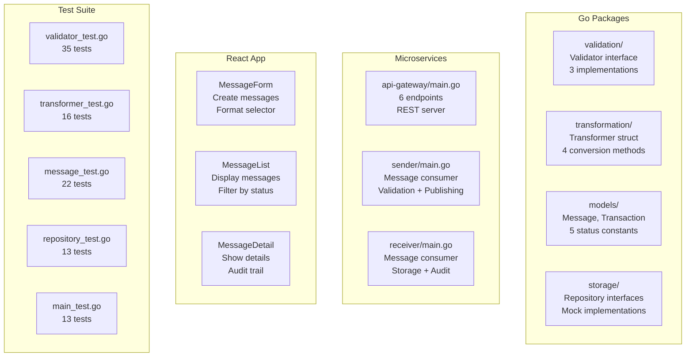

  

## Quick Start

  

```bash

# Run all tests

go test ./... -v

  

# Build and start

docker-compose up -d

  

# Access services

Frontend: http://localhost:3000

API: http://localhost:8080/api/v1/health

RabbitMQ: http://localhost:15673

```

  

## Status: Phase 2 Complete ✓

  

- ✓ Format validation (X12, EDIFACT, XML)

- ✓ Format transformation (cross-format conversion)

- ✓ Message lifecycle (create → validate → process)

- ✓ Audit trail (transaction history)

- ✓ REST API (6 endpoints)

- ✓ React Dashboard (message management)

- ✓ Docker orchestration (all services)

- ✓ 99 passing tests (100% coverage)