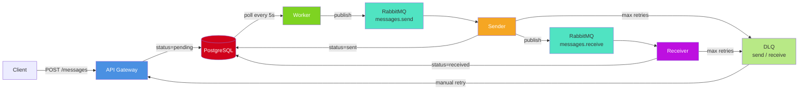

# Phase 3: Message Queue & Reliability

**Status:** COMPLETE — Updated February 22, 2026

---

## Architecture

---

## Message Status Flow

\`\`\`mermaid
stateDiagram-v2
[*] --> pending : API stores message
pending --> published : Worker publishes
published --> sent : Sender validates + DB update
published --> failed : Validation error
sent --> received : Receiver updates DB
sent --> DLQ : DB fails after 3 retries
received --> [*]
DLQ --> pending : Operator retries via API
\`\`\`

---

## Services

| Service     | File                        | Role                                                   |
| ----------- | --------------------------- | ------------------------------------------------------ |
| Worker      | \`cmd/worker/main.go\`      | Polls DB every 5s, publishes pending messages          |
| Sender      | \`cmd/sender/main.go\`      | Validates, sets status=sent, forwards to receive queue |
| Receiver    | \`cmd/receiver/main.go\`    | Sets status=received, records transaction              |
| API Gateway | \`cmd/api-gateway/main.go\` | Exposes queue/DLQ status and manual retry              |

---

## Reliability: Retry & DLQ

\`\`\`mermaid
flowchart TD
A[Receive message] --> B{DB update OK?}
B -->|yes| C[Ack + record transaction]
B -->|no - row not found| D[Ack + discard log warning]
B -->|no - other error| E{retries < 3?}
E -->|yes| F[Nack + requeue 1s then 2s then 4s backoff]
E -->|no| G[Send to DLQ Ack original]
F --> A
\`\`\`

> **Key fix (Feb 2026):** \`UpdateStatus\` now checks \`RowsAffected()\` and returns \`ErrMessageNotFound\` when the row is missing.
> Both sender and receiver handle this explicitly — log + ack + discard — instead of retrying forever.

---

## Configuration

All queue names and retry behaviour are env-var driven:

| Variable                    | Default          | Description                             |
| --------------------------- | ---------------- | --------------------------------------- |
| \`RABBITMQ_SENDER_QUEUE\`   | \`sender\`       | Routing key for worker → sender queue   |
| \`RABBITMQ_RECEIVER_QUEUE\` | \`receiver\`     | Routing key for sender → receiver queue |
| \`RABBITMQ_EXCHANGE\`       | \`edi.messages\` | Exchange name                           |
| \`MAX_RETRIES\`             | \`3\`            | Max retry attempts before DLQ           |
| \`INITIAL_BACKOFF_MS\`      | \`1000\`         | First retry delay (ms)                  |
| \`MAX_BACKOFF_MS\`          | \`4000\`         | Maximum retry delay (ms)                |
| \`DLQ_TTL_MS\`              | \`3600000\`      | DLQ message TTL (1 hour)                |

---

## Storage Layer

**\`internal/storage/errors.go\`** — shared error sentinels:

\`\`\`go
var (
ErrMessageNotFound // UpdateStatus: row not found (0 rows affected)
ErrInvalidMessage // Store: empty ID
ErrInvalidTransaction // Record: empty ID or MessageID
)
\`\`\`

---

## API Endpoints

| Method   | Path                                   | Purpose                        |
| -------- | -------------------------------------- | ------------------------------ | ----------------- |
| `GET`    | `/api/v1/queue/status`                 | Queue depths + consumer counts |
| `GET`    | `/api/v1/queue/dlq?type=send           | receive`                       | DLQ message count |
| \`POST\` | \`/api/v1/queue/dlq/{id}/retry\`       | Re-queue a DLQ message         |
| \`GET\`  | \`/api/v1/messages/{id}/transactions\` | Full audit trail for a message |

---

## Testing

\`\`\`bash
make test-storage # mock repo + sqlmock postgres tests (ErrMessageNotFound)
make test-pipeline # pending → sent → received end-to-end simulation
make test # full suite
\`\`\`

Pipeline test covers:

- **Happy path** — message transitions pending → sent → received with correct transactions
- **Missing row** — receiver handles \`ErrMessageNotFound\` gracefully (ack + discard)
- **Validation failure** — invalid message marked \`failed\`, not forwarded to receive queue

---

## Container Stack

\`\`\`
postgres :5433 DB
rabbitmq :5673 Broker + management UI (:15673)
api-gateway :8080 REST API
worker polls DB, publishes to queue
sender processes send queue
receiver processes receive queue
frontend :3000 React dashboard
\`\`\`
