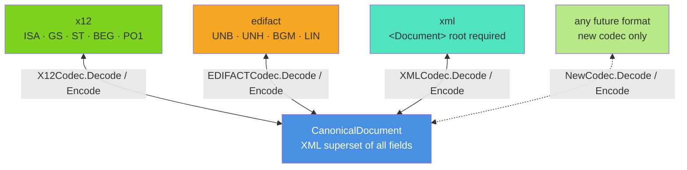
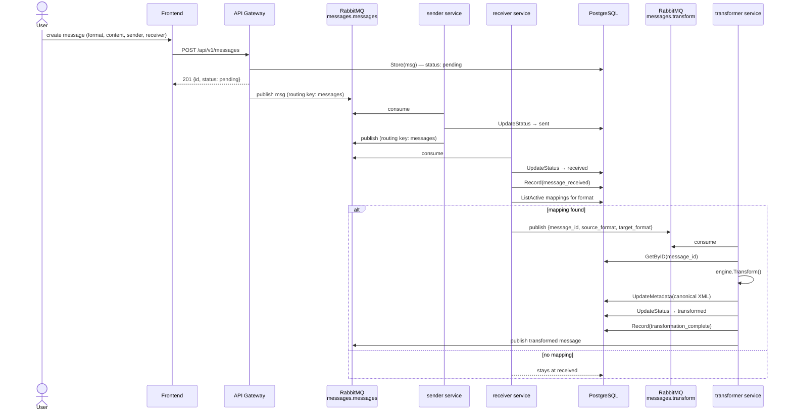
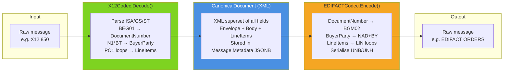
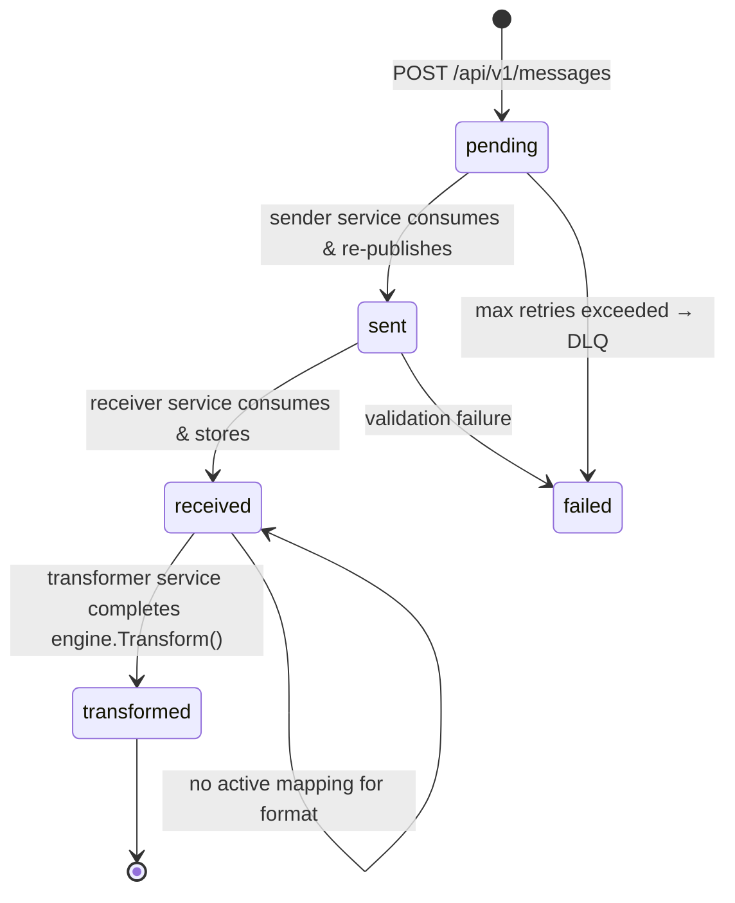
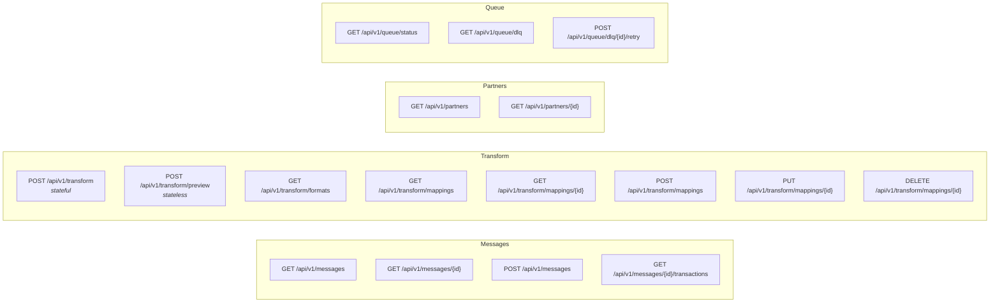
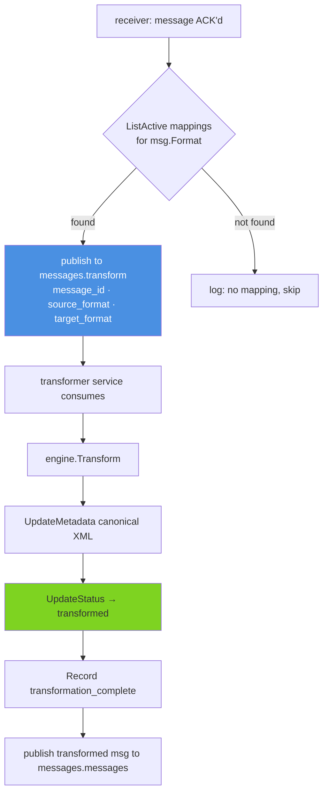
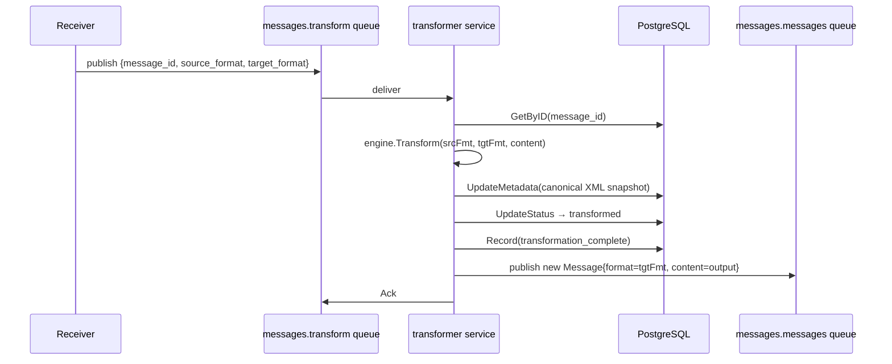
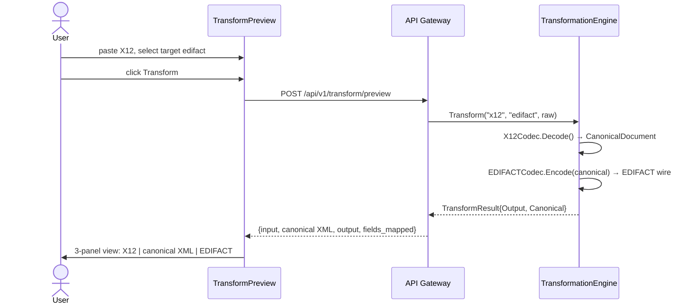

# Phase 5: Canonical Transformation Engine

**Status:** COMPLETE ✅  
**Started:** February 22, 2026  
**Last updated:** March 1, 2026

---

## Progress Summary

### Completed ✅

| Area                  | Files                                                      | Notes                                                                                                                                        |
| --------------------- | ---------------------------------------------------------- | -------------------------------------------------------------------------------------------------------------------------------------------- |
| Canonical model       | `internal/transformation/canonical/document.go`            | `CanonicalDocument`, `CanonicalEnvelope`, `PurchaseOrder`, `Party`, `LineItem` with XML tags                                                 |
| Field constants       | `internal/transformation/canonical/purchase_order.go`      | Named index constants for X12 and EDIFACT segment parsing                                                                                    |
| Codec interface       | `internal/transformation/codec/codec.go`                   | `FormatCodec` interface: `Decode`, `Encode`, `Format`                                                                                        |
| X12 codec             | `internal/transformation/codec/x12.go`                     | Full ISA/GS/ST/BEG/N1/PO1 decode + encode for X12 850                                                                                        |
| EDIFACT codec         | `internal/transformation/codec/edifact.go`                 | Full UNB/UNH/BGM/DTM/NAD/LIN/QTY/PRI decode + encode                                                                                         |
| XML codec             | `internal/transformation/codec/xml.go`                     | `encoding/xml` marshal/unmarshal of `CanonicalDocument`; requires `<Document>` root                                                          |
| Transformation engine | `internal/transformation/engine.go`                        | `NewTransformationEngine`, `Transform`, `RegisterCodec`, `SupportedFormats`, `SupportedTransformations`, `CanonicalXML`, `CountMappedFields` |
| Transformer shim      | `internal/transformation/transformer.go`                   | Backward-compat wrapper around engine                                                                                                        |
| Schema                | `schema/init.sql`                                          | `transformed` status in CHECK constraint, `transformation_mappings` table (6 pairs), `trading_partners` table (8 rows), all indexes          |
| Storage interface     | `internal/storage/repository.go`                           | `UpdateMetadata(ctx, id, xmlSnapshot string) error` in `MessageRepository`                                                                   |
| Mapping repository    | `internal/storage/mapping_repository.go`                   | Full CRUD: `ListActive`, `GetByFormats`, `GetByID`, `Create`, `Update`, `Delete` (soft)                                                      |
| Partner repository    | `internal/storage/partner_repository.go`                   | `PartnerRepository` interface, `MockPartnerRepository`, `PostgresPartnerRepository` with `ListActive` / `GetByID`                            |
| TradingPartner model  | `internal/models/partner.go`                               | `TradingPartner` struct with `id`, `name`, `country`, `preferred_format`, `edi_qualifier`, `edi_id`, `active`                                |
| Storage errors        | `internal/storage/errors.go`                               | `ErrMappingNotFound`, `ErrPartnerNotFound`                                                                                                   |
| Mock + Postgres impls | `internal/storage/mock.go`, `internal/storage/postgres.go` | `UpdateMetadata` with `SetEscapeHTML(false)` to keep XML clean in JSONB                                                                      |
| API gateway           | `cmd/api-gateway/main.go`                                  | 14 endpoints including partners, mapping CRUD, transform, preview                                                                            |
| Transformer service   | `cmd/transformer/main.go`                                  | Async consumer: reads from `messages.transform` queue, calls engine, publishes result                                                        |
| Receiver auto-trigger | `cmd/receiver/main.go`                                     | After `received`, queries active mappings and publishes to `messages.transform` automatically                                                |
| docker-compose        | `docker-compose.yml`                                       | All 8 services; `RABBITMQ_TRANSFORM_QUEUE: transform` on receiver                                                                            |
| Frontend preview      | `frontend/src/components/TransformPreview.jsx`             | 3-panel layout: raw → canonical XML → output                                                                                                 |
| Frontend form         | `frontend/src/components/MessageForm.jsx`                  | Sender + Receiver dropdowns populated from `/api/v1/partners`                                                                                |
| Populate script       | `scripts/populate.sh`                                      | 7 realistic automotive messages: X12 850/810/856, EDIFACT ORDERS/INVOIC, XML PO/Invoice                                                      |
| Tests                 | `cmd/api-gateway/main_test.go`, `internal/storage/`        | 46 tests total — all pass                                                                                                                    |

---

## Final Test Count

```
ok  github.com/theo-gedin/edi-simulator/cmd/api-gateway          (35 tests)
ok  github.com/theo-gedin/edi-simulator/internal/models
ok  github.com/theo-gedin/edi-simulator/internal/storage         (19 tests)
ok  github.com/theo-gedin/edi-simulator/internal/transformation
ok  github.com/theo-gedin/edi-simulator/internal/transformation/codec
ok  github.com/theo-gedin/edi-simulator/internal/validation
ok  github.com/theo-gedin/edi-simulator/internal/pipeline
```

`go test ./... -count=1` exits 0.

---

## Why a Canonical Model

A direct mapper per format pair creates a combinatorial explosion:

| Formats | Direct mappers needed | Canonical codecs needed |
| ------- | --------------------- | ----------------------- |
| 4       | 12                    | 8                       |
| 6       | 30                    | 12                      |
| 10      | 90                    | 20                      |

Every professional ESB (MuleSoft, BizTalk, IBM Integration Bus) solves this with a **hub-and-spoke canonical model**:

```
All formats converge to one shared representation → diverge back out.
Adding a new format costs exactly 2 artefacts (Decode + Encode).
Zero existing code changes.
```

---

## Global Architecture



---

## End-to-End Pipeline (Full)

This is the complete message flow including the async auto-transform introduced in Phase 5:



---

## Two-Layer Architecture (Codec Detail)



The canonical document is **never used as wire format** — it lives in memory during transformation and as a JSONB snapshot in `Message.Metadata` for audit purposes. XML is serialised with `SetEscapeHTML(false)` to preserve `<`, `>`, `&` correctly inside JSONB.

---

## Canonical Document Model

```go
// CanonicalDocument is the shared in-memory representation of any EDI document.
type CanonicalDocument struct {
    XMLName  xml.Name          `xml:"Document"`
    Envelope CanonicalEnvelope `xml:"Envelope"`
    Body     PurchaseOrder     `xml:"Body"`
}

type CanonicalEnvelope struct {
    Sender        string    `xml:"Sender"`
    Receiver      string    `xml:"Receiver"`
    ControlNumber string    `xml:"ControlNumber"`
    CreatedAt     time.Time `xml:"CreatedAt"`
}

type PurchaseOrder struct {
    DocumentNumber string     `xml:"DocumentNumber"`
    OrderDate      time.Time  `xml:"OrderDate"`
    Currency       string     `xml:"Currency"`
    BuyerParty     Party      `xml:"BuyerParty"`
    SellerParty    Party      `xml:"SellerParty"`
    LineItems      []LineItem `xml:"LineItems>LineItem"`
}

type Party struct {
    ID      string `xml:"ID"`
    Name    string `xml:"Name"`
    Address string `xml:"Address"`
}

type LineItem struct {
    LineNumber    int     `xml:"LineNumber"`
    ProductID     string  `xml:"ProductID"`
    Description   string  `xml:"Description"`
    Quantity      float64 `xml:"Quantity"`
    UnitPrice     float64 `xml:"UnitPrice"`
    UnitOfMeasure string  `xml:"UnitOfMeasure"`
}
```

> **XML root constraint:** `XMLCodec.Decode()` requires `<Document>` as the root element. Messages with `<PurchaseOrder>` or any other root will be rejected with 400.

---

## Directory Layout

```
internal/
├── models/
│   ├── message.go            ← Message, Transaction, status constants
│   └── partner.go            ← TradingPartner struct  [NEW Phase 5]
├── storage/
│   ├── repository.go         ← MessageRepository, TransactionRepository interfaces
│   ├── mapping_repository.go ← MappingRepository: CRUD + Mock + Postgres impl
│   ├── partner_repository.go ← PartnerRepository: ListActive, GetByID + Mock + Postgres  [NEW]
│   ├── errors.go             ← ErrMessageNotFound, ErrMappingNotFound, ErrPartnerNotFound
│   ├── postgres.go           ← Postgres impls (SetEscapeHTML fix for XML in JSONB)
│   └── mock.go               ← In-memory impls for all repos
└── transformation/
    ├── engine.go              ← TransformationEngine (registry + orchestration)
    ├── transformer.go         ← Backward-compat shim
    ├── canonical/
    │   ├── document.go        ← CanonicalDocument, Envelope, PurchaseOrder structs
    │   └── purchase_order.go  ← XML field mapping constants
    └── codec/
        ├── codec.go           ← FormatCodec interface
        ├── x12.go             ← X12Codec: ISA/GS/ST/BEG/PO1 ↔ CanonicalDocument
        ├── edifact.go         ← EDIFACTCodec: UNB/UNH/BGM/LIN ↔ CanonicalDocument
        └── xml.go             ← XMLCodec: encoding/xml marshal/unmarshal

cmd/
├── api-gateway/main.go       ← 14 HTTP endpoints
├── sender/main.go
├── receiver/main.go          ← [UPDATED] auto-publishes to transform queue
└── transformer/main.go       ← Async transform consumer

schema/
└── init.sql                  ← messages, transactions, transformation_mappings, trading_partners

frontend/src/components/
├── MessageForm.jsx            ← [UPDATED] Sender + Receiver partner dropdowns
├── TransformPreview.jsx       ← 3-panel transform UI
└── ...

scripts/
└── populate.sh                ← 7 realistic automotive EDI messages
```

---

## Database Schema

### Full Schema (Phase 5 Final State)

```sql
-- Messages (unchanged from Phase 1, status extended)
CREATE TABLE messages (
    id          UUID PRIMARY KEY DEFAULT gen_random_uuid(),
    format      VARCHAR(50) NOT NULL DEFAULT 'X12',
    content     TEXT NOT NULL,
    metadata    JSONB DEFAULT '{}'::jsonb,   -- canonical XML snapshot stored here
    sender      VARCHAR(255),
    receiver    VARCHAR(255),
    status      VARCHAR(50) DEFAULT 'pending'
                CHECK (status IN ('pending','sent','received','processed','failed','transformed')),
    created_at  TIMESTAMP DEFAULT CURRENT_TIMESTAMP,
    updated_at  TIMESTAMP DEFAULT CURRENT_TIMESTAMP,
    published_at TIMESTAMP DEFAULT NULL
);

-- Transformation mappings: registry of supported format routes
CREATE TABLE transformation_mappings (
    id            UUID PRIMARY KEY DEFAULT gen_random_uuid(),
    name          TEXT NOT NULL,
    source_format TEXT NOT NULL,
    target_format TEXT NOT NULL,
    active        BOOLEAN NOT NULL DEFAULT true,
    description   TEXT,
    created_at    TIMESTAMPTZ NOT NULL DEFAULT now()
);

-- Seeded with 6 pairs:
-- x12 ↔ edifact, x12 → xml, edifact → xml, xml → x12, xml → edifact

-- Trading partners: simulated companies for EDI send/receive  [NEW]
CREATE TABLE trading_partners (
    id               UUID PRIMARY KEY DEFAULT gen_random_uuid(),
    name             TEXT NOT NULL,
    country          CHAR(2) NOT NULL DEFAULT 'US',
    preferred_format TEXT NOT NULL CHECK (preferred_format IN ('x12','edifact','xml')),
    edi_qualifier    TEXT NOT NULL DEFAULT 'ZZ',
    edi_id           TEXT NOT NULL,
    active           BOOLEAN NOT NULL DEFAULT true,
    created_at       TIMESTAMPTZ NOT NULL DEFAULT now()
);
```

### Message Status Lifecycle



---

## Trading Partners

Eight simulated automotive companies seed the `trading_partners` table. They enable the UI sender/receiver dropdowns and the populate script.

| Name                 | Country | Preferred Format | EDI ID       |
| -------------------- | ------- | ---------------- | ------------ |
| Autoparts Co         | US      | x12              | AUTOPARTS01  |
| Supplier Corp        | US      | x12              | SUPPLIER01   |
| EuroParts GmbH       | DE      | edifact          | EUROPARTS01  |
| RetailEU SARL        | FR      | edifact          | RETAILEU01   |
| AsiaPac Motors       | HK      | xml              | ASIAPAC01    |
| Global Auto Supply   | US      | xml              | GLOBALAUTO01 |
| NordikParts AS       | NO      | edifact          | NORDIKP01    |
| Pacific Logistics Co | AU      | x12              | PACLOGIS01   |

Partners are seeded idempotently in `schema/init.sql` (no double-insert on restart).

---

## API Endpoints (Full Phase 5 Surface)



### Endpoint Reference

| Method   | Path                              | Purpose                                              |
| -------- | --------------------------------- | ---------------------------------------------------- |
| `GET`    | `/api/v1/partners`                | List all 8 active trading partners                   |
| `GET`    | `/api/v1/partners/{id}`           | Get a single partner                                 |
| `GET`    | `/api/v1/transform/formats`       | List registered format keys                          |
| `GET`    | `/api/v1/transform/mappings`      | List active mapping pairs                            |
| `POST`   | `/api/v1/transform/mappings`      | Create a new mapping                                 |
| `GET`    | `/api/v1/transform/mappings/{id}` | Get a single mapping                                 |
| `PUT`    | `/api/v1/transform/mappings/{id}` | Update name / description / active                   |
| `DELETE` | `/api/v1/transform/mappings/{id}` | Soft-delete (sets `active = false`)                  |
| `POST`   | `/api/v1/transform/preview`       | Stateless: decode → canonical → encode, return all 3 |
| `POST`   | `/api/v1/transform`               | Stateful: transform + store canonical + record audit |

`POST /api/v1/transform/preview` response:

```json
{
  "source_format": "x12",
  "target_format": "edifact",
  "input": "ISA*00*...",
  "canonical": "<Document><Envelope>...</Envelope><Body>...</Body></Document>",
  "output": "UNA:+.? 'UNB+...",
  "fields_mapped": 12
}
```

`DELETE /api/v1/transform/mappings/{id}` returns `204 No Content`. The row is not deleted — `active` is set to `false`.

---

## Receiver Auto-Transform (Async Pipeline)

After successfully storing a message as `received`, the receiver looks up an active mapping for the message's format and, if one exists, publishes a transform request to the `messages.transform` queue:



Mapping selection rule: **first active mapping whose `source_format` matches** the incoming message's format. If multiple target formats are registered for the same source, only the first (by DB order) is used — enough for the simulation use case.

---

## Transformer Service (Async Consumer)



The new message published back has a fresh UUID, `Format = targetFormat`, `Content = result.Output`, and starts its own pipeline journey from `pending`.

---

## Frontend — MessageForm with Trading Partners

The `MessageForm` component now fetches `/api/v1/partners` on mount and shows Sender / Receiver dropdowns:

```
┌─────────────────────────────────────────┐
│  Sender                Receiver          │
│  ┌──────────────────┐  ┌──────────────┐  │
│  │ Autoparts Co  ▼  │  │EuroParts  ▼  │  │
│  │  US · X12        │  │  DE · EDIFACT│  │
│  └──────────────────┘  └──────────────┘  │
│                                          │
│  Format                                  │
│  [ X12 EDI ▼ ]                           │
│                                          │
│  Message Content          [Load Sample]  │
│  ┌──────────────────────────────────┐    │
│  │  ISA*00*...                      │    │
│  └──────────────────────────────────┘    │
│  [ Create Message ]      [ Cancel ]      │
└─────────────────────────────────────────┘
```

`sender` and `receiver` are stored on the `messages` row and visible in the message detail view and audit trail.

---

## Frontend — Transform Preview Component

```
┌────────────────────────────────────────────────────────────┐
│  Source: [x12 ▼]  →  Target: [edifact ▼]   [Transform]    │
├───────────────────┬──────────────────┬────────────────────┤
│ Raw Input (X12)   │ Canonical (XML)  │ Output (EDIFACT)   │
│                   │                  │                     │
│ ISA*00*...        │ <Document>       │ UNA:+.? '           │
│ GS*PO*...         │   <Envelope>     │ UNB+IATB:1...       │
│ ST*850*0001       │     <Sender>...  │ UNH+1+ORDERS...     │
│ BEG*00*SA*...     │   <Body>         │ BGM+220+...         │
│                   │     <PurchaseOrder>│                   │
│ [paste here]      │ [read-only]      │ [read-only]         │
└───────────────────┴──────────────────┴────────────────────┘
│  12 fields mapped  |  X12 850 → EDIFACT ORDERS             │
```



---

## Interface Contracts

### FormatCodec

```go
type FormatCodec interface {
    Decode(raw string) (*canonical.CanonicalDocument, error)
    Encode(doc *canonical.CanonicalDocument) (string, error)
    Format() string
}
```

### MappingRepository (Full CRUD)

```go
type MappingRepository interface {
    ListActive(ctx context.Context) ([]TransformationMapping, error)
    GetByFormats(ctx context.Context, src, tgt string) (*TransformationMapping, error)
    GetByID(ctx context.Context, id string) (*TransformationMapping, error)
    Create(ctx context.Context, m *TransformationMapping) (*TransformationMapping, error)
    Update(ctx context.Context, m *TransformationMapping) (*TransformationMapping, error)
    Delete(ctx context.Context, id string) error   // soft-delete: sets active = false
    Close() error
}
```

### PartnerRepository

```go
type PartnerRepository interface {
    ListActive(ctx context.Context) ([]models.TradingPartner, error)
    GetByID(ctx context.Context, id string) (*models.TradingPartner, error)
    Close() error
}
```

**Adding a new format** (e.g. JSON, CSV):

1. Create `codec/json.go` implementing `FormatCodec`
2. Register it in `engine.go` startup
3. Done — no other files change

---

## Implementation Notes & Decisions

| Decision                                 | Choice                                   | Rationale                                                           |
| ---------------------------------------- | ---------------------------------------- | ------------------------------------------------------------------- |
| Canonical model vs direct mapping        | Canonical XML superset                   | 2N codecs vs N×(N-1) mappers                                        |
| Codec owns both syntax and field mapping | Single `FormatCodec` interface           | One interface, one file per format                                  |
| Canonical is XML (not JSON)              | XML-tagged Go struct                     | Native `encoding/xml`; readable audit artefact                      |
| Canonical stored in `Message.Metadata`   | JSONB snapshot (XML string, HTML-safe)   | D-005 reserved this; no schema change                               |
| `SetEscapeHTML(false)` on JSON encoder   | `bytes.Buffer + json.NewEncoder`         | Prevents `<` → `\u003c` corruption in JSONB                         |
| XML root constraint                      | Requires `<Document>`                    | XMLCodec enforces this; partial XML rejected early                  |
| Auto-transform trigger                   | Receiver (after `received`)              | Closest to data; no extra round-trip; mappingRepo already available |
| Mapping CRUD soft-delete                 | `active = false`                         | Preserves history; re-activatable; no FK cascade needed             |
| Preview endpoint is stateless            | `POST /transform/preview`                | Explore without polluting DB; pipeline stays async                  |
| Partner dropdowns in UI                  | Fetched from `/api/v1/partners` on mount | Decoupled from hardcoded lists; reflects live DB                    |

---

## Known Bugs Fixed During Phase 5

| Bug                                      | Root cause                                                                                                      | Fix                                                                           |
| ---------------------------------------- | --------------------------------------------------------------------------------------------------------------- | ----------------------------------------------------------------------------- |
| Messages stuck in `pending`              | `docker-compose.yml` routing key mismatches (sender/receiver used defaults `sender`/`receiver`, not `messages`) | Set `RABBITMQ_SENDER_QUEUE: messages` and `RABBITMQ_RECEIVER_QUEUE: messages` |
| `pq: invalid input syntax for type json` | `nil` metadata on `POST /api/v1/messages` passed as SQL NULL                                                    | Default to `{}` when `len(req.Metadata) == 0`                                 |
| XML `<` `>` mangled in JSONB             | `json.Marshal` HTML-escapes angle brackets                                                                      | Replace with `json.NewEncoder` + `SetEscapeHTML(false)`                       |
| Messages never reached `transformed`     | Live DB `status` CHECK constraint predated `'transformed'` (old volume)                                         | `ALTER TABLE DROP/ADD CONSTRAINT` to include `'transformed'`                  |
| `docker-compose` crashes                 | Python v1.29.2 CLI incompatible with new Docker image manifests (`KeyError: 'ContainerConfig'`)                 | Always use `docker compose` (v2 plugin, space-separated)                      |

---

## Out of Scope for Phase 5

| Feature                                   | Rationale                                                   |
| ----------------------------------------- | ----------------------------------------------------------- |
| CIUS / country-specific format variants   | Sub-variants out of scope; canonical covers standard fields |
| X12 856 / EDIFACT DESADV codecs           | Canonical struct defined; deferred                          |
| X12 810 / EDIFACT INVOIC codecs           | Canonical struct defined; deferred                          |
| Visual mapping editor                     | Phase 6 territory                                           |
| Full ASC X12 / UN/EDIFACT spec compliance | Segment-level parsing sufficient for simulation             |
| Multi-target fan-out                      | Receiver picks first active mapping per format              |

