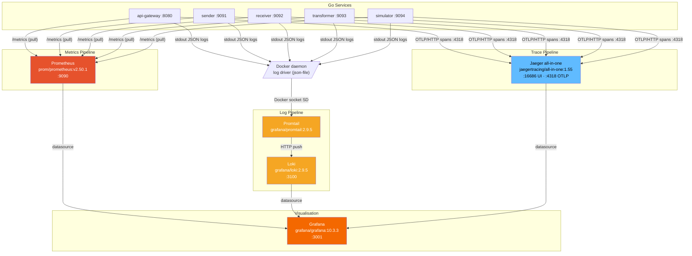
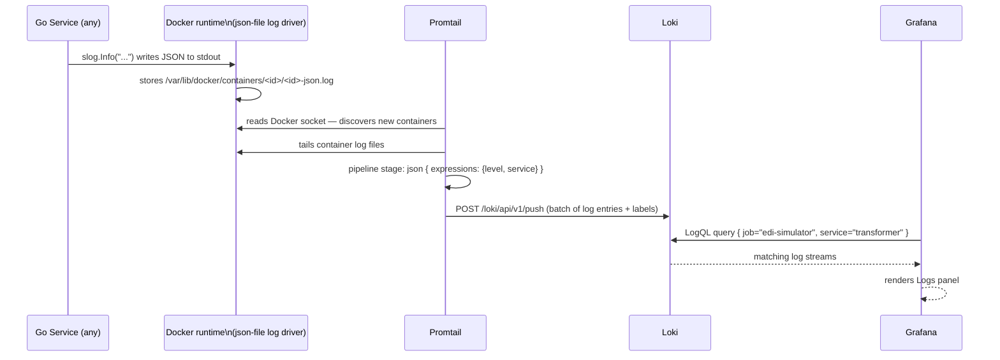
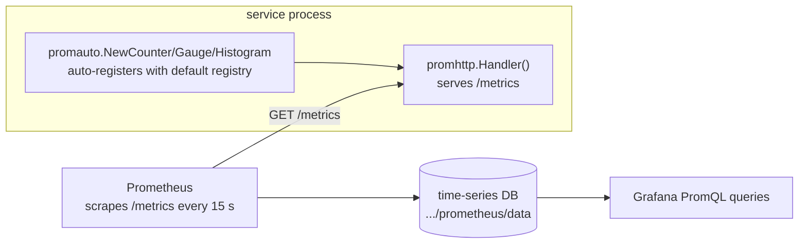
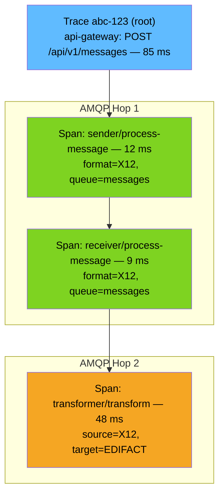
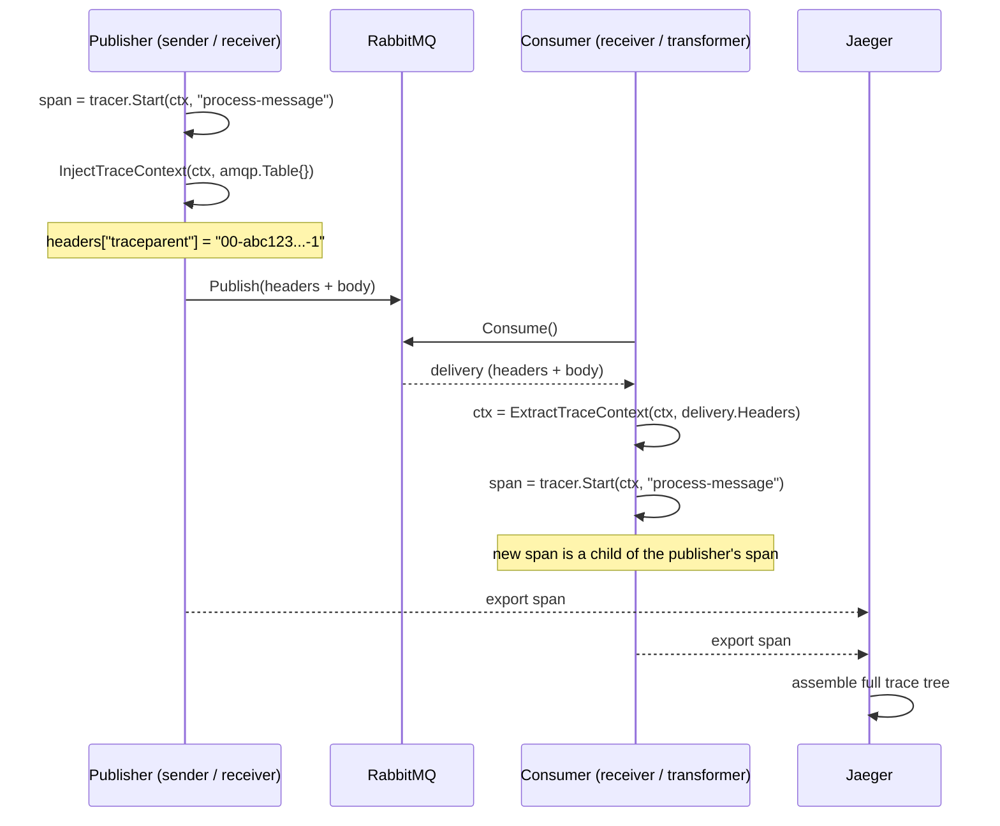
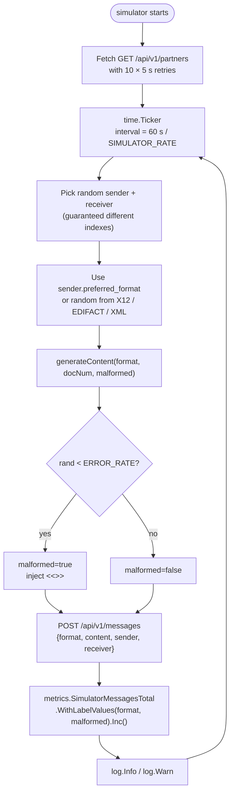
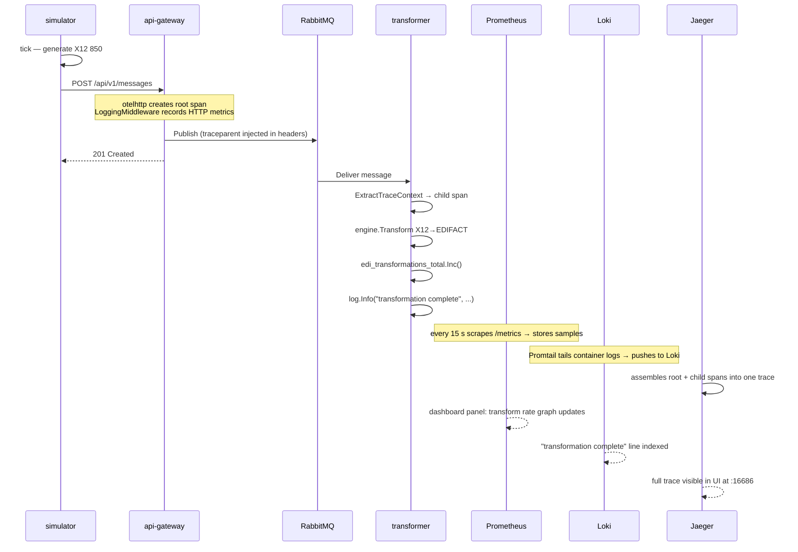

# Phase 6: Full-Stack Observability

**Status:** COMPLETE ✅  
**Go version:** 1.25.0  
**Monitoring stack:** Prometheus · Grafana · Loki · Promtail · Jaeger

---

## Progress Summary

### New files ✅

| File                                                                | Purpose                                                           |
| ------------------------------------------------------------------- | ----------------------------------------------------------------- |
| `internal/logger/logger.go`                                         | Shared `slog` JSON logger factory; pre-attaches `"service"` field |
| `internal/metrics/metrics.go`                                       | All 8 Prometheus metric definitions shared across services        |
| `internal/tracing/tracing.go`                                       | OTel OTLP/HTTP provider init; no-op when endpoint is empty        |
| `cmd/simulator/main.go`                                             | Continuous EDI traffic generator (X12 / EDIFACT / XML)            |
| `monitoring/prometheus/prometheus.yml`                              | Scrape config for all 5 service `/metrics` endpoints              |
| `monitoring/loki/loki-config.yml`                                   | Loki single-binary config with `/tmp/loki` base path              |
| `monitoring/promtail/promtail-config.yml`                           | Docker socket discovery → JSON parse → Loki push                  |
| `monitoring/grafana/provisioning/datasources/datasources.yml`       | Auto-provisions Prometheus, Loki, Jaeger datasources              |
| `monitoring/grafana/provisioning/dashboards/dashboard-provider.yml` | Points Grafana at `/var/lib/grafana/dashboards`                   |
| `monitoring/grafana/dashboards/edi-simulator.json`                  | Pre-built 9-panel EDI Simulator dashboard                         |
| `Dockerfile.prebuilt`                                               | Alternate Dockerfile; copies a host-compiled static binary        |

### Modified files ✅

| File                             | What changed                                                                              |
| -------------------------------- | ----------------------------------------------------------------------------------------- |
| `internal/config/config.go`      | `OTELEndpoint`, `MetricsPort`, `Simulator*` fields + `getEnvFloat`/`getEnvBool` helpers   |
| `internal/http/middleware.go`    | `responseRecorder`, UUID path normalisation, slog + Prometheus in `LoggingMiddleware`     |
| `internal/messaging/rabbitmq.go` | `amqpCarrier`, `InjectTraceContext`, `ExtractTraceContext`; `Publish` injects W3C headers |
| `cmd/api-gateway/main.go`        | slog init, tracing init, otelhttp wrap, `/metrics` endpoint, queue-depth goroutine        |
| `cmd/sender/main.go`             | Metrics server `:9091`, slog, per-message OTel spans, DLQ counter                         |
| `cmd/receiver/main.go`           | Metrics server `:9092`, slog, per-message OTel spans                                      |
| `cmd/transformer/main.go`        | Metrics server `:9093`, slog, per-message OTel spans, transformation counter              |
| `cmd/worker/main.go`             | slog logger; `processMessages` takes `*slog.Logger` param                                 |
| `docker-compose.yml`             | 6 new services; `OTEL_ENDPOINT` + `METRICS_PORT` env vars on all Go services              |
| `Dockerfile`                     | `golang:1.22-alpine` → `golang:1.25-alpine` (matches `go.mod` requirement)                |

---

## Why Observability — The Three Pillars

Before Phase 6 the system was a **black box**: messages flowed through queues and databases but there was no way to answer questions like:

- Is the transformer falling behind?
- Which partner is causing the most failures?
- How long does an X12→EDIFACT round-trip take end to end?
- Service X crashed at 03:14 — what was it doing at that moment?

Observability answers these questions through three complementary lenses:

| Pillar      | Tool (this project)    | What it gives you                                                                   |
| ----------- | ---------------------- | ----------------------------------------------------------------------------------- |
| **Metrics** | Prometheus + Grafana   | Aggregated numbers over time — rates, latencies, queue depths, error ratios         |
| **Logs**    | slog + Loki + Grafana  | Timestamped events with structured fields — searchable, filterable, correlatable    |
| **Traces**  | OpenTelemetry + Jaeger | The exact path a single request took through every service, with per-step durations |

The three pillars are **complementary, not redundant**. A dashboard spike (metric) tells you _something is wrong_. Logs tell you _which service and why_. A trace tells you _exactly which message and where time was spent_.

---

## Overall Monitoring Architecture



---

## Pillar 1 — Structured Logging

### Why structured logging over `fmt.Printf`

`fmt.Printf("received message %s", id)` produces a string. Tools cannot parse it. `slog.Info("message received", "id", id, "format", fmt)` produces:

```json
{
  "time": "2026-03-01T14:23:01Z",
  "level": "INFO",
  "service": "receiver",
  "msg": "message received",
  "id": "abc-123",
  "format": "X12"
}
```

Now Loki can filter `{service="receiver"} | json | level="ERROR"` and return only errors from the receiver, or `| id="abc-123"` to follow a single message across all services.

### `internal/logger` package

```go
// New creates a JSON logger for the named service at the given level.
// It also calls slog.SetDefault(l) so the package-level slog functions
// (used by middleware.go and messaging/rabbitmq.go) work correctly.
func New(service, level string) *slog.Logger {
    var lvl slog.Level
    switch strings.ToLower(level) {
    case "debug":
        lvl = slog.LevelDebug
    case "warn", "warning":
        lvl = slog.LevelWarn
    case "error":
        lvl = slog.LevelError
    default:
        lvl = slog.LevelInfo
    }
    opts := &slog.HandlerOptions{Level: lvl}
    l := slog.New(slog.NewJSONHandler(os.Stdout, opts)).
        With("service", service)
    slog.SetDefault(l)
    return l
}
```

The `With("service", service)` call **pre-attaches** the field to every log line from that logger. Middleware and RabbitMQ code can use `slog.Default()` without knowing the service name.

### Log flow: service → Grafana



Promtail labels extracted from each JSON log line:

| Promtail label   | Source              | Example value     |
| ---------------- | ------------------- | ----------------- |
| `job`            | Static (config)     | `edi-simulator`   |
| `container_name` | Docker SD relabel   | `edi-transformer` |
| `service`        | JSON pipeline stage | `transformer`     |
| `level`          | JSON pipeline stage | `ERROR`           |

---

## Pillar 2 — Metrics

### Prometheus pull model

Prometheus **polls** each service's `/metrics` HTTP endpoint every 15 seconds. It stores raw samples as a time-series database. No service needs to know Prometheus exists — they just expose `/metrics` and respond when queried.



### All 8 metrics defined in `internal/metrics/metrics.go`

| Metric name                               | Type      | Labels                                     | Description                                   |
| ----------------------------------------- | --------- | ------------------------------------------ | --------------------------------------------- |
| `edi_messages_processed_total`            | Counter   | `service`, `format`, `status`              | Total messages processed per service          |
| `edi_message_processing_duration_seconds` | Histogram | `service`                                  | Processing time per message; buckets 5 ms–5 s |
| `edi_queue_depth`                         | Gauge     | `queue`                                    | Current AMQP queue depth (polled every 15 s)  |
| `edi_transformations_total`               | Counter   | `source_format`, `target_format`, `status` | Transformation attempts and outcomes          |
| `edi_http_requests_total`                 | Counter   | `method`, `path`, `status_code`            | HTTP request volume per endpoint              |
| `edi_http_request_duration_seconds`       | Histogram | `method`, `path`                           | HTTP latency; buckets 1 ms–1 s                |
| `edi_dlq_messages_total`                  | Counter   | `service`, `queue`                         | Messages that landed in the Dead Letter Queue |
| `edi_simulator_messages_total`            | Counter   | `format`, `malformed`                      | Messages sent by the simulator                |

### Metrics endpoint map

| Service       | `/metrics` address         | Notes                      |
| ------------- | -------------------------- | -------------------------- |
| `api-gateway` | `api-gateway:8080/metrics` | Shared mux with REST API   |
| `sender`      | `sender:9091/metrics`      | Dedicated goroutine server |
| `receiver`    | `receiver:9092/metrics`    | Dedicated goroutine server |
| `transformer` | `transformer:9093/metrics` | Dedicated goroutine server |
| `simulator`   | `simulator:9094/metrics`   | Dedicated goroutine server |

### UUID path normalisation

Without normalisation, every message ID creates a unique metric label:

```
edi_http_requests_total{path="/api/v1/messages/abc-123"} 1
edi_http_requests_total{path="/api/v1/messages/def-456"} 1
```

`normaliseMetricsPath()` in `middleware.go` collapses all UUID-shaped segments to `{id}`:

```
edi_http_requests_total{path="/api/v1/messages/{id}"} 4218
```

This is critical — unbounded label cardinality in Prometheus causes out-of-memory crashes.

---

## Pillar 3 — Distributed Tracing

### Why distributed tracing

A single EDI message travels through 4 services (api-gateway → sender → receiver → transformer) and 2 queues. Without tracing, you cannot answer "why did this specific message take 800 ms instead of 50 ms?" — because the latency could be in any of those hops.

A **trace** is a tree of **spans**. Each span represents one unit of work (handle an HTTP request, process a queue message, run a transformation). Spans have a start time, duration, and attributes. The tree is linked by a `trace-id` that is propagated through every hop.



### `internal/tracing` package

```go
// InitProvider configures the global OTel TracerProvider and returns a shutdown func.
// If endpoint is empty, a no-op provider is installed — the process still compiles
// and runs, it just never exports spans.
func InitProvider(serviceName, endpoint string) func() {
    if endpoint == "" {
        return func() {}
    }
    exp, _ := otlptracehttp.New(ctx,
        otlptracehttp.WithEndpoint(endpoint),
        otlptracehttp.WithInsecure(),
    )
    res, _ := resource.New(ctx,
        resource.WithAttributes(semconv.ServiceNameKey.String(serviceName)),
    )
    tp := sdktrace.NewTracerProvider(
        sdktrace.WithBatcher(exp),
        sdktrace.WithResource(res),
        sdktrace.WithSampler(sdktrace.AlwaysSample()),
    )
    otel.SetTracerProvider(tp)
    otel.SetTextMapPropagator(propagation.NewCompositeTextMapPropagator(
        propagation.TraceContext{},
        propagation.Baggage{},
    ))
    return func() { tp.Shutdown(ctx) }
}
```

Usage in every service `main()`:

```go
defer tracing.InitProvider("receiver", cfg.OTELEndpoint)()
```

The `defer` ensures the provider shuts down gracefully when the process exits, flushing any buffered spans.

### Trace context across AMQP

HTTP requests carry trace context in standard `traceparent` headers. AMQP messages have no such standard, so a custom carrier bridges the gap:



The `amqpCarrier` type in `internal/messaging/rabbitmq.go` implements `propagation.TextMapCarrier` by wrapping an `amqp.Table` (a `map[string]interface{}`):

```go
type amqpCarrier amqp.Table

func (c amqpCarrier) Get(key string) string   { /* read from map */ }
func (c amqpCarrier) Set(key, val string)      { c[key] = val }
func (c amqpCarrier) Keys() []string           { /* keys of map */ }
```

---

## Pillar 4 — Continuous Simulator

The simulator is not strictly an observability tool, but it is what **generates the signal** that makes the observability stack useful. Without a steady stream of realistic traffic, dashboards are empty.

### Architecture



### EDI content generated

Each tick produces a **deterministic, schema-valid** EDI document. The `docNum` counter increments on every tick:

**X12 850 Purchase Order**

```
ISA*00*          *00*          *ZZ*SENDER         *ZZ*RECEIVER       *260302*1423*X*00501*000123456*0*P*>~
GS*PO*SENDER*RECEIVER*20260302*142300*123456*X*005010~
ST*850*0001~
BEG*00*SA*PO-123456**20260302~
PO1*1*42*EA*18.50**IN*ITEM001~
SE*4*0001~
GE*1*123456~
IEA*1*000123456~
```

**EDIFACT ORDERS D:96A**

```
UNB+UNOA:3+SENDER+RECEIVER+260302:1423+123456'
UNH+1+ORDERS:D:96A:UN:EAN008'
BGM+220+PO-123456+9'
DTM+137:20260302:102'
LIN+1++ITEM001:IN'
QTY+21:42'
PRI+AAA:18.50'
UNT+7+1'
UNZ+1+123456'
```

**XML Purchase Order**

```xml
<?xml version="1.0" encoding="UTF-8"?>
<PurchaseOrder>
  <PONumber>PO-123456</PONumber>
  <OrderDate>2026-03-02</OrderDate>
  <LineItems>
    <LineItem>
      <ItemID>ITEM001</ItemID>
      <Quantity>42</Quantity>
      <UnitPrice>18.50</UnitPrice>
    </LineItem>
  </LineItems>
</PurchaseOrder>
```

When `malformed=true`, a null byte followed by `<<<CORRUPT>>>` is injected at a random offset, deliberately triggering the validation → DLQ pipeline to generate DLQ metric signals.

### Simulator environment variables

| Variable               | Default                 | Description                                   |
| ---------------------- | ----------------------- | --------------------------------------------- |
| `SIMULATOR_ENABLED`    | `true`                  | Set `false` to start container but do nothing |
| `SIMULATOR_RATE`       | `10`                    | Messages per minute                           |
| `SIMULATOR_ERROR_RATE` | `0.15`                  | Fraction of messages to corrupt (0.0–1.0)     |
| `SIMULATOR_API_URL`    | `http://localhost:8080` | Base URL of api-gateway                       |

Increase throughput without restarting: edit `docker-compose.yml` and `docker compose up -d simulator`.

---

## Grafana Dashboard

The pre-provisioned dashboard `monitoring/grafana/dashboards/edi-simulator.json` loads automatically on first Grafana startup. Open it at **http://localhost:3001** (user `admin`, password `admin`).

### Panel map

```mermaid
graph TD
    subgraph Row 1 — KPI Stats
        P1["Messages / min\nrate(edi_messages_processed_total[1m])"]
        P2["Queue Depth\nedi_queue_depth{queue='messages'}"]
        P3["Transform Success %\nrate(success) / rate(total)"]
        P4["DLQ last hour\nincrease(edi_dlq_messages_total[1h])"]
    end

    subgraph Row 2 — Time Series
        P5["Message flow by format\nrate per 1 m"]
        P6["HTTP req/s by path\nrate per 1 m"]
        P7["P95 HTTP latency\nhistogram_quantile(0.95, ...)"]
        P8["Simulator throughput\nrate per 1 m, split by format+malformed"]
    end

    subgraph Row 3 — Logs
        P9["Error logs (Loki)\n{job='edi-simulator'} | json | level='ERROR'"]
    end
```

### Datasources auto-provisioned

| Name       | UID          | URL                      |
| ---------- | ------------ | ------------------------ |
| Prometheus | `prometheus` | `http://prometheus:9090` |
| Loki       | `loki`       | `http://loki:3100`       |
| Jaeger     | `jaeger`     | `http://jaeger:16686`    |

All three are added via `monitoring/grafana/provisioning/datasources/datasources.yml`. No manual click-through needed.

---

## Docker Compose — New Services

| Service      | Image                           | Host port                  | Purpose                          |
| ------------ | ------------------------------- | -------------------------- | -------------------------------- |
| `simulator`  | `prebuilt`                      | —                          | Continuous EDI traffic generator |
| `prometheus` | `prom/prometheus:v2.50.1`       | `9090`                     | Metrics scraper + TSDB           |
| `grafana`    | `grafana/grafana:10.3.3`        | `3001→3000`                | Dashboard + datasource UI        |
| `loki`       | `grafana/loki:2.9.5`            | `3100`                     | Log aggregation backend          |
| `promtail`   | `grafana/promtail:2.9.5`        | —                          | Log shipper (Docker SD)          |
| `jaeger`     | `jaegertracing/all-in-one:1.55` | `16686` (UI) `4318` (OTLP) | Distributed trace backend        |

Total containers after Phase 6: **14**.

---

## End-to-End Observability Flow

This sequence shows how a single simulated message creates signal in all three pillars simultaneously:



---

## Directory Layout (Phase 6 additions)

```
monitoring/
├── grafana/
│   ├── dashboards/
│   │   └── edi-simulator.json          ← 9-panel pre-built dashboard
│   └── provisioning/
│       ├── dashboards/
│       │   └── dashboard-provider.yml  ← tells Grafana where to find JSONs
│       └── datasources/
│           └── datasources.yml         ← Prometheus + Loki + Jaeger
├── loki/
│   └── loki-config.yml                 ← common: path_prefix /tmp/loki
├── prometheus/
│   └── prometheus.yml                  ← 5 scrape jobs, 15 s interval
└── promtail/
    └── promtail-config.yml             ← Docker SD → JSON pipeline → Loki

internal/
├── config/
│   └── config.go                       ← + OTELEndpoint, MetricsPort, Simulator*
├── http/
│   └── middleware.go                   ← + responseRecorder, UUID normalisation
├── logger/
│   └── logger.go                       ← NEW — slog JSON factory
├── messaging/
│   └── rabbitmq.go                     ← + amqpCarrier, InjectTraceContext, ExtractTraceContext
├── metrics/
│   └── metrics.go                      ← NEW — 8 promauto metric vars
└── tracing/
    └── tracing.go                      ← NEW — OTel OTLP/HTTP provider

cmd/
└── simulator/
    └── main.go                         ← NEW — continuous traffic generator
```

---

## Problems Solved During Phase 6

| Problem                                         | Root cause                                                                                                                                                               | Fix                                                                                                |
| ----------------------------------------------- | ------------------------------------------------------------------------------------------------------------------------------------------------------------------------ | -------------------------------------------------------------------------------------------------- |
| `go mod tidy` removed OTel/Prometheus deps      | Source files hadn't been created yet when tidy ran first                                                                                                                 | Created all source files first, ran `go mod tidy` once after                                       |
| Dockerfile build failed                         | `go.mod` requires Go 1.25.0; Dockerfile used `golang:1.22-alpine`                                                                                                        | Changed base image tag to `golang:1.25-alpine`                                                     |
| Docker Hub unreachable during session           | Local network had no external Docker registry access                                                                                                                     | Cross-compiled static binaries on host with `CGO_ENABLED=0 GOOS=linux`, used `Dockerfile.prebuilt` |
| Loki crash: `field final_sleep not found`       | Field was removed in Loki v2.9.5                                                                                                                                         | Removed `final_sleep` from ingester config block                                                   |
| Loki crash: `mkdir wal: permission denied`      | Default WAL path `/wal` not writable by non-root Loki process                                                                                                            | Added `wal.dir: /tmp/loki/wal` explicitly                                                          |
| Loki crash: `mkdir : no such file or directory` | Compactor working directory also unset                                                                                                                                   | Rewrote entire config with `common: path_prefix: /tmp/loki` which sets all sub-dirs uniformly      |
| Simulator: "could not fetch partners"           | API returns `{"partners":[...]}` envelope; code tried to decode into `[]partner` directly                                                                                | Added `partnersResponse` wrapper struct matching the envelope shape                                |
| Simulator: all messages rejected (400)          | DB stores `"x12"` lowercase; format switch matched `"X12"` — all fell to `default` (XML) branch, sending XML content with format label `x12` which failed X12 validation | Changed format switch to use `strings.ToLower(format)`                                             |

---

## How to Run

```bash
# Start everything
docker compose up -d

# Check all 14 containers are healthy
docker compose ps

# Watch simulator traffic in real time
docker compose logs -f simulator

# Open the Grafana dashboard
xdg-open http://localhost:3001   # Linux
open http://localhost:3001        # macOS
# Login: admin / admin

# Open Jaeger trace UI
xdg-open http://localhost:16686

# Open Prometheus expression browser
xdg-open http://localhost:9090

# Increase simulator rate without restart
# Edit docker-compose.yml: SIMULATOR_RATE: "30"
docker compose up -d simulator

# Stop everything
docker compose down
```
