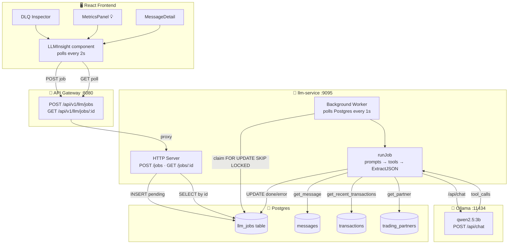
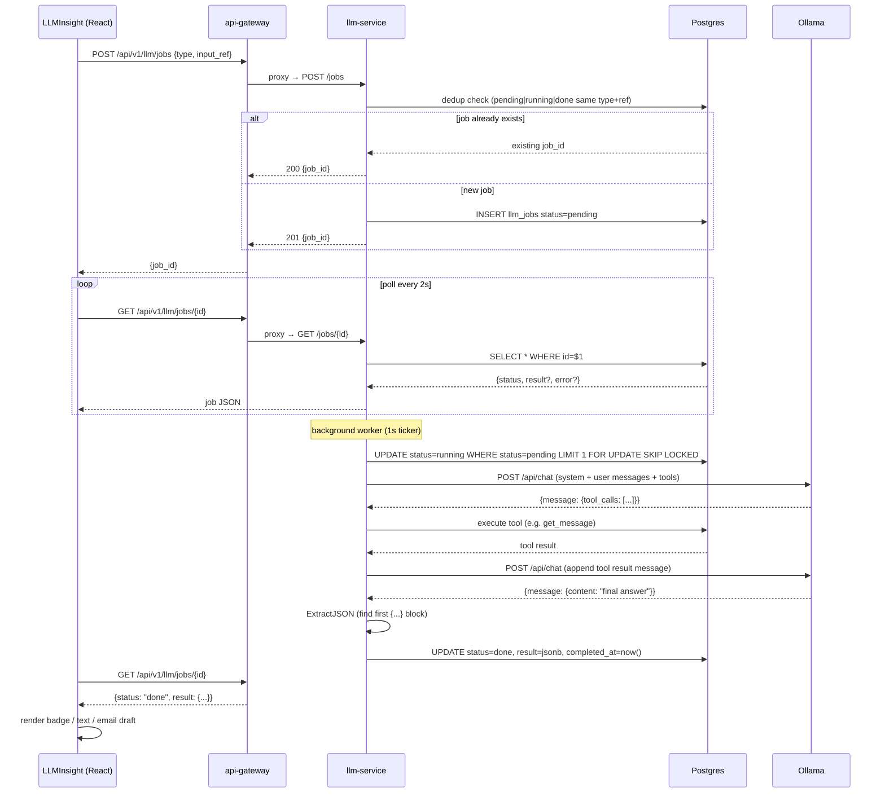
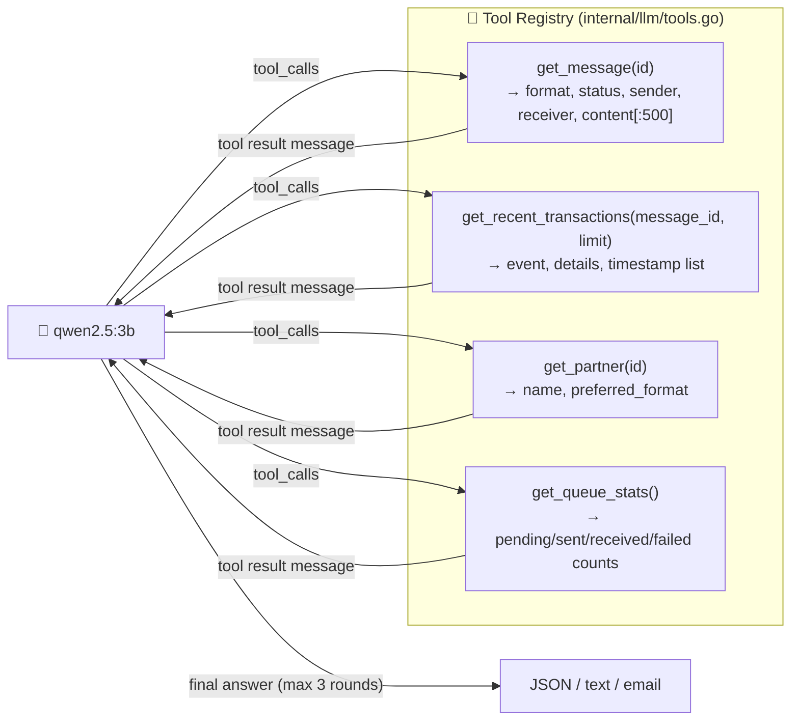
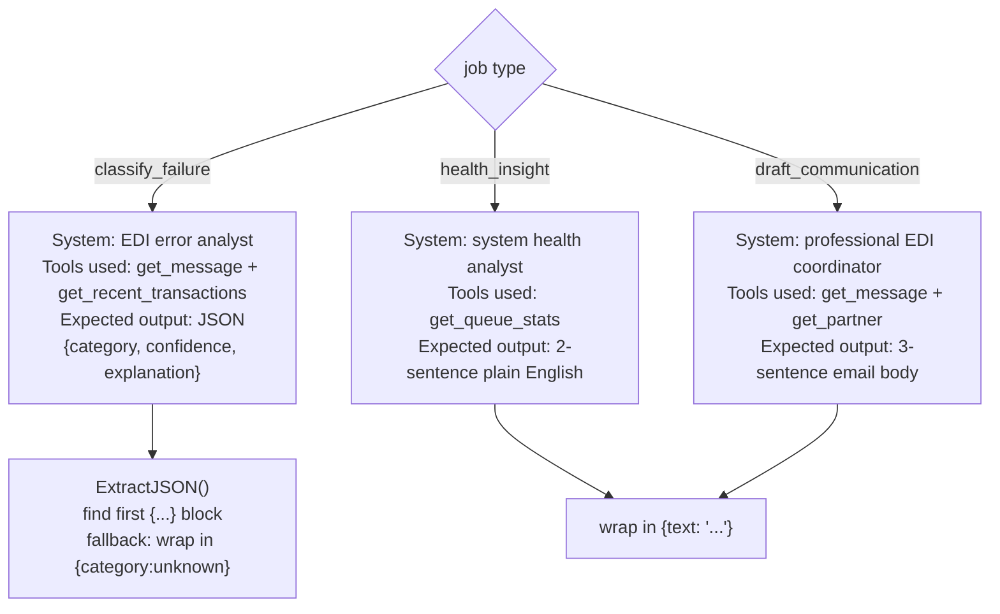

# Phase 7: LLM / MCP Integration (qwen2.5:3b via Ollama)

**Status:** ✅ IMPLEMENTED  
**Model:** `qwen2.5:3b` via Ollama — CPU-only, runs inside Docker, no GPU required  
**Architecture:** Async job queue — UI never waits on the model

---

## What it does

Three AI-powered features surface contextual intelligence directly in the dashboard:

| Feature | Trigger | Output |
|---|---|---|
| `classify_failure` | Auto-triggered in DLQ Inspector per failed message | Badge: category + confidence + 1-sentence explanation |
| `health_insight` | 💡 button in stats bar (visible when failed > 0) | 2-sentence plain-English summary of pipeline health |
| `draft_communication` | Button in MessageDetail after classify completes | 3-sentence professional email body to trading partner |

None of these block the UI — they submit a job and poll for the result.

---

## System architecture



---

## Async job lifecycle



---

## Tool calling (MCP-style)

The model has access to 4 tools that read live data from the database. This is the "MCP" part — the model directs which data to fetch.



**Max iterations:** 3 tool call rounds before returning whatever the model has.  
**Timeout:** 120s per job (CPU inference takes ~20–40s with tools).

---

## Prompt strategies per job type



`classify_failure` is the only job that requires valid JSON output from the model. The `ExtractJSON` helper is needed because the model sometimes wraps its response in prose or non-ASCII decorators.

---

## File inventory

### New files

| File | Purpose |
|---|---|
| `cmd/llm-service/main.go` | HTTP server + background worker for job processing |
| `internal/llm/ollama.go` | Ollama HTTP client — `PostChat()` and `RunWithTools()` |
| `internal/llm/tools.go` | 4 MCP tool definitions + SQL executors + `ToolRegistry` |
| `internal/llm/prompts.go` | `BuildMessages(jobType, inputRef)` — system+user messages per job type |
| `internal/llm/util.go` | `ExtractJSON(s)` — finds first `{...}` block in model output |
| `scripts/ollama-entrypoint.sh` | Starts Ollama, pulls `qwen2.5:3b`, waits |
| `frontend/src/components/LLMInsight.jsx` | React component — creates job, polls, renders result |
| `frontend/src/components/LLMInsight.css` | Styles for spinner, badges, category chips |

### Modified files

| File | Change |
|---|---|
| `docker-compose.yml` | Added `ollama` (port 11434) and `llm-service` (port 9095) services, `ollama_data` volume |
| `schema/init.sql` | Added `llm_jobs` table with status constraint + two indexes |
| `internal/config/config.go` | Added `OllamaURL`, `LLMServiceURL`, `LLMServicePort` fields |
| `cmd/api-gateway/main.go` | Added two proxy routes: `POST /api/v1/llm/jobs` and `GET /api/v1/llm/jobs/{id}` |
| `frontend/src/components/MetricsPanel.jsx` | Added `LLMInsight` import, 💡 button on Failed card, floating insight panel |
| `frontend/src/components/MessageDetail.jsx` | Added "🤖 Ask AI" classify button + "📧 Draft" button for failed messages |
| `frontend/src/components/DLQInspector.jsx` | Renders `<LLMInsight type="classify_failure" inputRef={msg.id} />` per row |

---

## Database schema

```sql
CREATE TABLE IF NOT EXISTS llm_jobs (
    id           UUID PRIMARY KEY DEFAULT gen_random_uuid(),
    type         VARCHAR(50)  NOT NULL,
    input_ref    UUID,                          -- message UUID for classify/draft, null for health_insight
    status       VARCHAR(20)  NOT NULL DEFAULT 'pending'
                   CHECK (status IN ('pending','running','done','error','timeout')),
    result       JSONB,                         -- set on done
    error        TEXT,                          -- set on error/timeout
    created_at   TIMESTAMPTZ  NOT NULL DEFAULT now(),
    completed_at TIMESTAMPTZ
);
CREATE INDEX IF NOT EXISTS idx_llm_jobs_status    ON llm_jobs(status);
CREATE INDEX IF NOT EXISTS idx_llm_jobs_input_ref ON llm_jobs(input_ref);
```

**Dedup logic:** before inserting a new job for `classify_failure` or `draft_communication`, the service checks for an existing row with `status IN ('pending','running','done')` for the same `(type, input_ref)`. If found, it returns the existing `job_id` with a `200` (not `201`), avoiding duplicate inference runs.

---

## Known constraints & fixes applied

| Problem | Root cause | Fix |
|---|---|---|
| `llm_jobs` table missing on startup | Postgres only runs `init.sql` on first boot; table was added after initial volume creation | Run migration directly: `docker exec edi-postgres psql -U edi_user -d edi_simulator -c "CREATE TABLE IF NOT EXISTS llm_jobs (...)"` |
| Job timeout at 30s | CPU inference + 2 tool calls takes ~40s | Increased to **120s** context timeout in worker |
| Model wraps JSON in prose / Chinese characters | Instruction-following limitation of small quantized model | `ExtractJSON()` scans the raw response for the first `{...}` block regardless of surrounding text |

---

## Verification

```bash
# 1. Check ollama pulled the model
docker logs edi-ollama | grep "qwen2.5:3b"

# 2. Check llm-service is up
docker logs edi-llm | tail -5
# → LLM service listening port=9095

# 3. Submit a health_insight job
curl -s -X POST http://localhost:8080/api/v1/llm/jobs \
  -H 'Content-Type: application/json' \
  -d '{"type":"health_insight"}'
# → {"job_id":"<uuid>"}

# 4. Poll until done (takes ~20-40s on CPU)
watch -n2 'curl -s http://localhost:8080/api/v1/llm/jobs/<uuid> | jq .'
# → {"status":"done","result":{"text":"The system shows..."}}

# 5. Submit a classify_failure job (requires a real failed message ID)
MSG_ID=$(curl -s http://localhost:8080/api/v1/messages | jq -r '[.[] | select(.status=="failed")] | first | .id')
curl -s -X POST http://localhost:8080/api/v1/llm/jobs \
  -H 'Content-Type: application/json' \
  -d "{\"type\":\"classify_failure\",\"input_ref\":\"$MSG_ID\"}"

# 6. In the UI: open DLQ Inspector → badge appears within ~30s on any failed message
```
